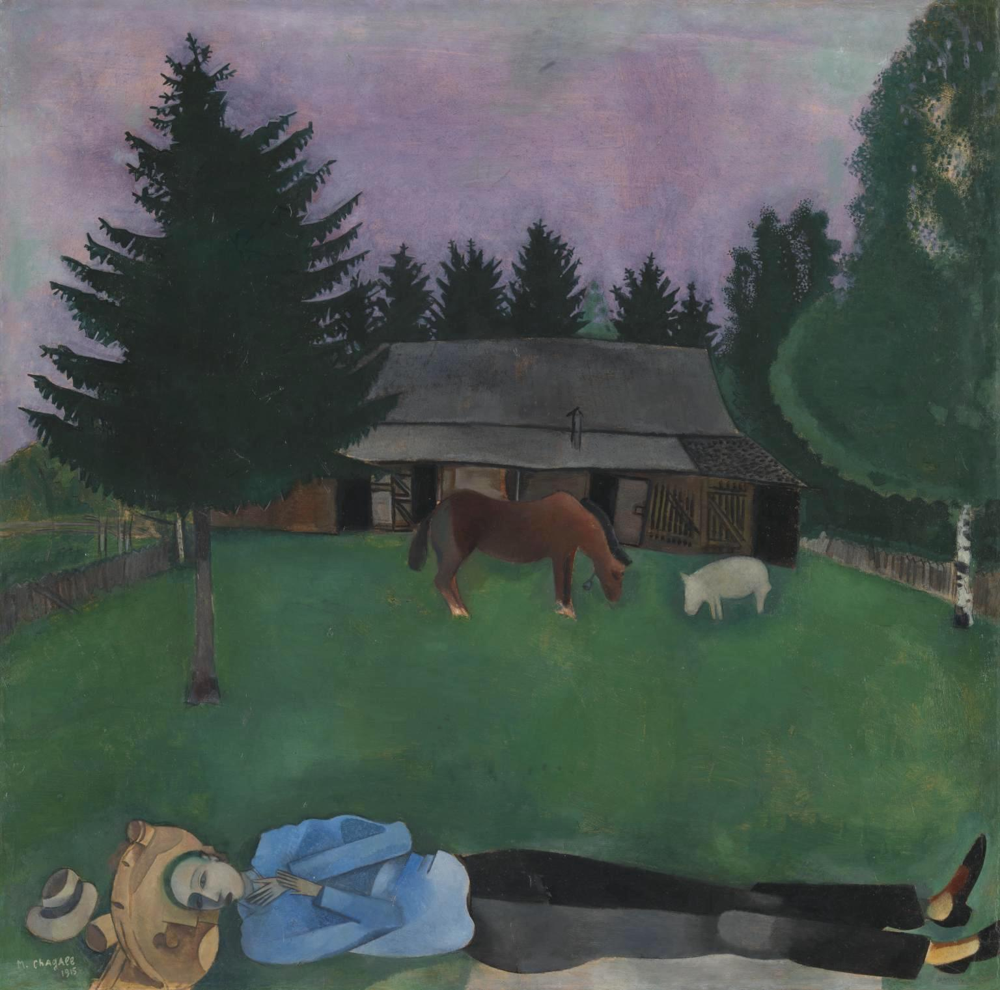

## 基本信息

- 作者：[[夏加尔 Marc Chagall]]
- 创作年代：1915
- 材质：布面油画 (*not from wiki*)
- 尺寸：约 77 × 77.5 cm (*not from wiki*)
- 现存地：伦敦泰特美术馆 (Tate) (*not from wiki*)

## 画面与技法

顾衡 077 把它和 [[埃菲尔铁塔下的新人 The Bride and Groom of the Eiffel Tower]] 一起，作为夏加尔**反复描绘"村子、农舍和牲口"**这一终身母题的代表，引出夏加尔的话："**我熟悉的就是教堂、篱笆、店铺和犹太人的聚会。**"

画面（典型构图）：诗人横卧前景，背景是农舍、马、远处的村庄；画面像**俯瞰的乡间一隅**——视点叠加是夏加尔标志手法。

## 历史背景 (*not from wiki*)

1915 年作于俄国——夏加尔与贝拉新婚之年，蜜月期间作于维切布斯克附近的乡间。

## 图片清单

| 编号 | 出自 | 描述 |
|---|---|---|
| 01 | [[077｜夏加尔：俄国人在巴黎]] | 横卧诗人 + 农舍 + 马 + 村庄背景 |

## 出现在

- [[077｜夏加尔：俄国人在巴黎]] —— "教堂、篱笆、店铺和犹太人的聚会"母题的代表
