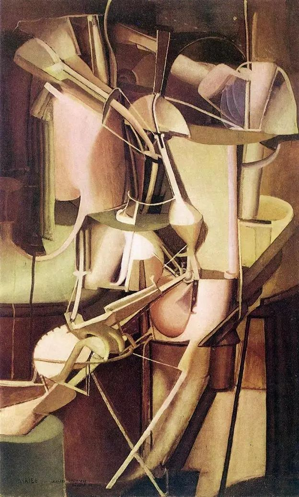

## 基本信息

- 作者：[[杜尚 Marcel Duchamp]]
- 创作年代：1912
- 材质：布面油画 (*not from wiki*)
- 尺寸：89.5 × 55 cm (*not from wiki*)
- 现存地：费城美术馆 (Philadelphia Museum of Art) (*not from wiki*)

## 画面与技法

1912 年杜尚在慕尼黑期间——《[[下楼梯的裸女 Nude Descending a Staircase No. 2]]》翻车后赌气式继续创作的"机器/运动"系列代表之一。顾衡将《新娘》《[[从处女到已婚妇女的过程 The Passage from Virgin to Bride]]》《[[国王和王后被快速移动的裸女包围着 King and Queen Surrounded by Swift Nudes]]》一并称为"杜尚一生中最好的几幅油画作品"——画面表现出"很多的机器，很多的运动"。

人体被还原为机械零部件、管线和透明色块的组合，是杜尚后来《新娘被她的男人们扒光衣服，甚至如此》(*The Large Glass*) 的母题源头。(*not from wiki*)

## 历史背景

(*not from wiki*) 1912 年慕尼黑作品。同年 10 月由 [[杜尚 Marcel Duchamp]] 大哥 [[杰克·维庸 Jacques Villon]] (*not from wiki*) 组织的《黄金分割展》上参展，借此机会和 [[阿波利奈尔 Guillaume Apollinaire]] 的吹捧，杜尚得以重回 [[皮托集团 Puteaux Group]] 视野。

## 图片清单

| 编号 | 出自 | 描述 |
|---|---|---|
| 01 | [[089｜杜尚2：什么是他人生的转折点？]] | 机器化新娘整图 |

## 出现在

- [[089｜杜尚2：什么是他人生的转折点？]]
