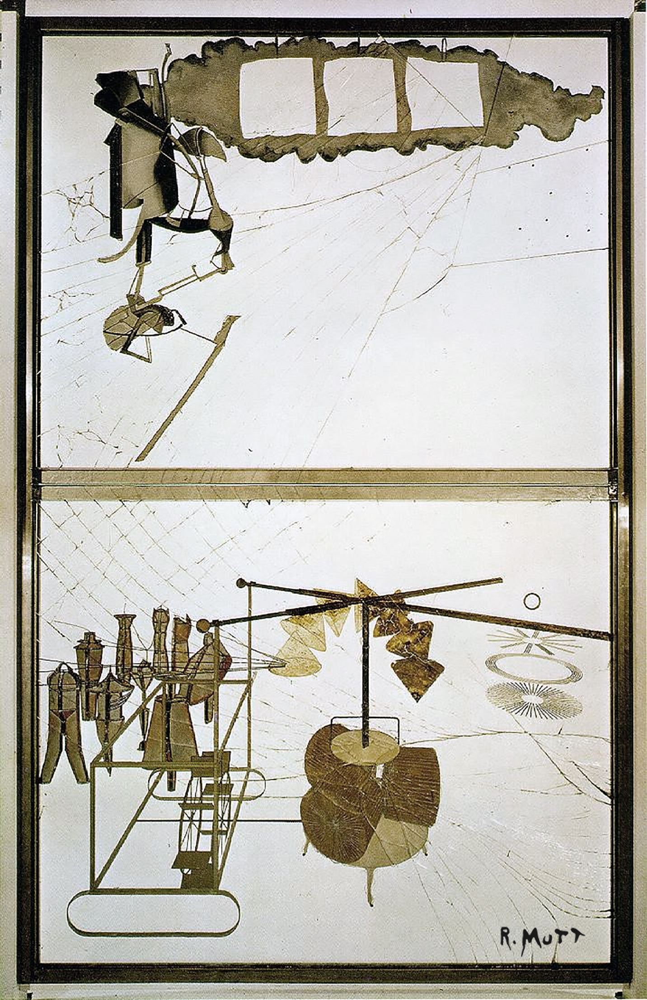

## 基本信息

- 作者：[[杜尚 Marcel Duchamp]]
- 创作年代：1915–1923
- 材质：玻璃、铅丝、油彩、清漆、银箔、灰尘 (*not from wiki*)
- 尺寸：约 277 × 176 cm (*not from wiki*)
- 现存地：费城美术馆 (*not from wiki*)

## 画面与技法

[[杜尚 Marcel Duchamp]] 在纽约时期的**核心装置作品**——两片玻璃叠加而成，上半部分（"新娘"区）+ 下半部分（"九个单身汉"区）。完整探索"机器学新娘"母题——是 1912 年《[[从处女到已婚妇女的过程 The Passage from Virgin to Bride]]》和《[[UDNIE 年轻的美国女孩 Udnie, Young American Girl]]》之后**机器画女人**这一思路的集大成。

本讲（091）作为**与 [[毕卡比亚 Francis Picabia]] 1915 年后"用机器表现女性 / 性"系列的对照**出现——"杜尚当时在搞《大玻璃》那个装置，而毕卡比亚是画画"。

## 历史背景

(*not from wiki*) 1923 年杜尚宣布作品"明确未完成"，停笔；1926 年送展运输途中玻璃破裂，杜尚后来表态"裂纹也是作品的一部分"。被广泛视为 20 世纪现代艺术最重要的装置之一。

## 图片清单

| 编号 | 出自 | 描述 |
|---|---|---|
| 01 | [[091｜毕卡比亚：如何用绘画表现达达主义？]] | 整体图 — 玻璃装置 (1915–1923) |

## 出现在

- [[091｜毕卡比亚：如何用绘画表现达达主义？]]
