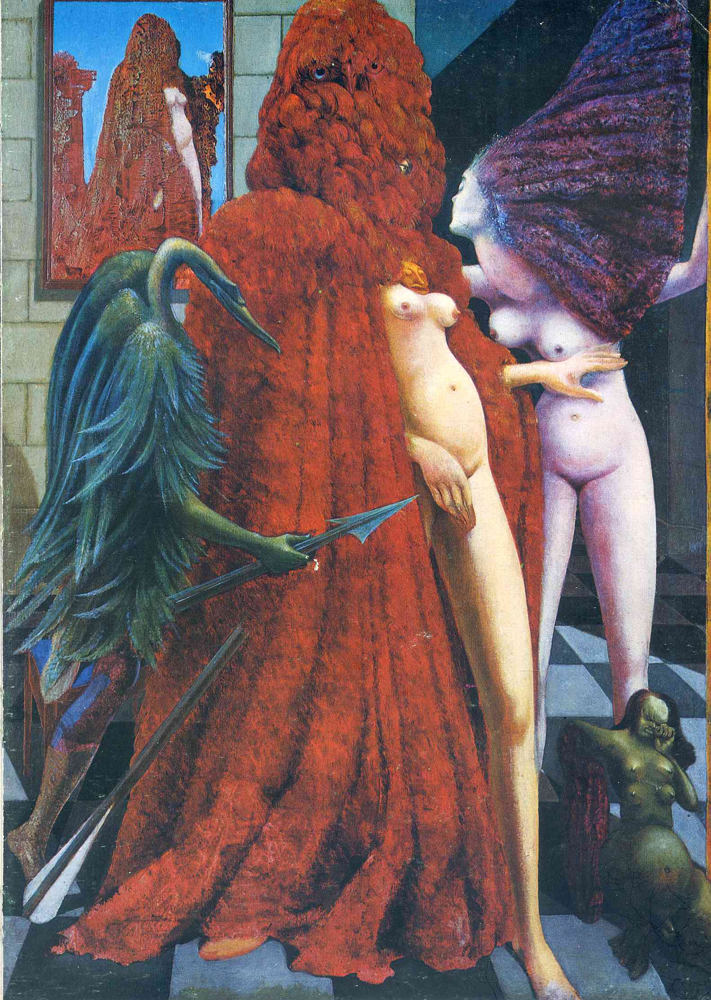

## 基本信息

- 作者：[[恩斯特 Max Ernst]]
- 创作年代：1940
- 材质：布面油画（[[拓印法 Decalcomania]]）(*not from wiki*)
- 尺寸：约 130 × 96 cm (*not from wiki*)
- 现存地：威尼斯佩姬·古根海姆美术馆 Peggy Guggenheim Collection, Venice (*not from wiki*)

## 画面与技法

[[拓印法 Decalcomania]] 代表作之一，也是恩斯特最广为人知的作品之一 (*not from wiki*)。把颜料涂在玻璃上压在画布上，颜料干后呈现奇妙的沼泽状/青苔状肌理；恩斯特再就着这片肌理塑造出披着橘红色羽毛大氅的"新娘"、矛枪武士、绿色变体人形等。

本课作为拓印法的三个典型样本之一（与《[[玛莲 (恩斯特) Marlene]]》《[[单生树与双生树 (恩斯特) Solitary Tree and Married Trees]]》并列）。

## 图片清单

| 编号 | 出自 | 描述 |
|---|---|---|
| 01 | [[093｜契里柯与恩斯特：如何用绘画表现超现实主义？]] | 一个披着橘红羽毛大氅的人形（鸟头），身边伴随武士与裸女，背景是开洞墙壁与远景 |

## 出现在

- [[093｜契里柯与恩斯特：如何用绘画表现超现实主义？]] — [[拓印法 Decalcomania]] 代表作
