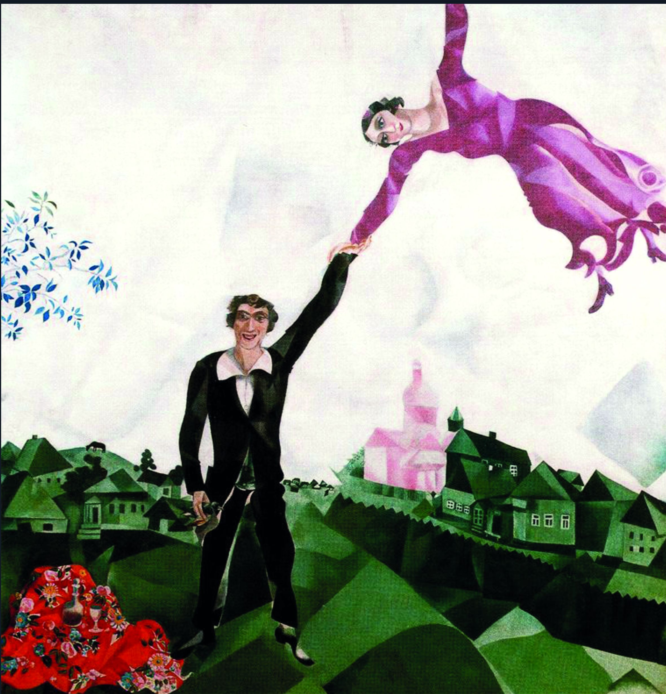

## 基本信息

- 作者：[[夏加尔 Marc Chagall]]
- 模特：[[贝拉·罗森菲尔德 Bella Rosenfeld]]
- 创作年代：1918
- 材质：布面油画 (*not from wiki*)
- 尺寸：约 175.2 × 168.4 cm (*not from wiki*)
- 现存地：圣彼得堡俄罗斯博物馆 (*not from wiki*)

## 画面与技法

夏加尔与贝拉婚后的代表作之一，本课文标题翻译为"新婚"（英文版常作 "The Promenade"，原法语 *La Promenade*）。

夏加尔牵着空中**漂浮**的贝拉的手，妻子像气球一样飘在他身后——这是夏加尔的标志性母题（夫妻 + 漂浮 + 维切布斯克乡村背景）的成熟版本。

顾衡 077 把它与 [[生日 (夏加尔) The Birthday]]、[[有两张脸的新娘 The Bride with Double Faces]]、[[埃菲尔铁塔下的新人 The Bride and Groom of the Eiffel Tower]] 并列为**以贝拉为题的代表作**。

## 历史背景 (*not from wiki*)

1918 年作于俄国革命之后、夏加尔短暂出任苏维埃文化部艺术局局长期间。此时夏加尔尚未与新政权决裂、尚未离开苏联（1922 年离开）。

## 图片清单

| 编号 | 出自 | 描述 |
|---|---|---|
| 01 | [[077｜夏加尔：俄国人在巴黎]] | 夏加尔牵漂浮的贝拉 |

## 出现在

- [[077｜夏加尔：俄国人在巴黎]] —— 贝拉肖像系列；漂浮新娘母题
