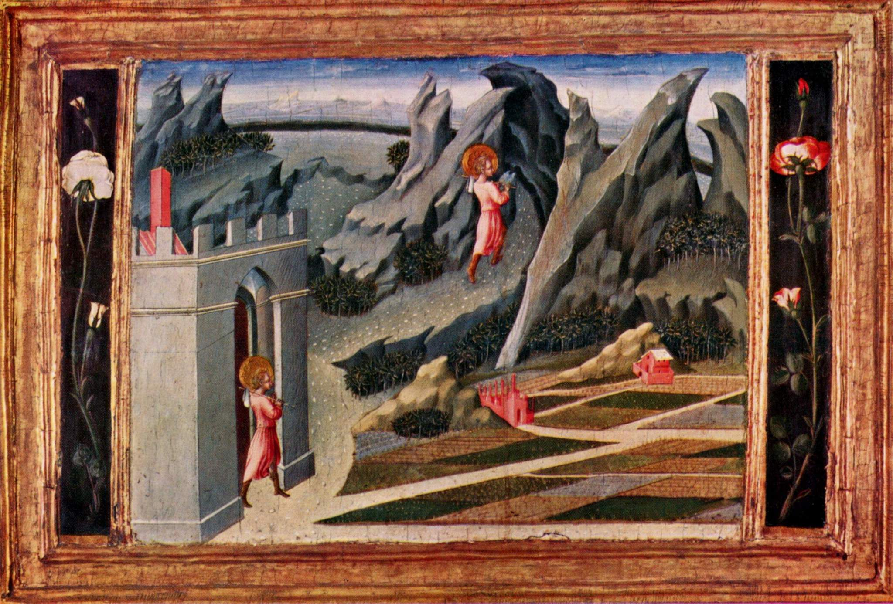

## 基本信息

- 作者：[[乔瓦尼·迪·保罗 Giovanni di Paolo]]
- 创作年代：1453
- 材质：木板蛋彩 (*not from wiki*)
- 尺寸：约 31 × 39 cm（小型祭坛画 predella 板） (*not from wiki*)
- 现存地：伦敦国家美术馆 (The National Gallery, London) (*not from wiki*)

## 画面与技法

构图独特——**同一画面里施洗约翰出现两次**：

- 左前：年轻的施洗约翰**告别城门**——城是**插画式平面化处理**，远近不真实
- 后景：约翰**爬上一座几何化的山** —— 山被画成**棕红色、像积木堆叠**的几何块
- 远景：**抽象的方格田**——色块分明的红黄绿块，**不是写实而是 mosaic 式装饰**

**顾衡 037 重点**：

- 这幅画**创作于 1453 年**——[[线性透视 Linear Perspective]] 已经被发明**一代人时间**了
- 但 [[乔瓦尼·迪·保罗 Giovanni di Paolo]] 作为**坚守拜占庭程式化风格的锡耶纳画家**——风景部分**就更没法看了**
- 顾衡用本作论证：**画家把风景画成这个样子竟然还有饭吃**，说明甲方与画家都认为**景色部分一点儿都不重要**

## 历史背景

(*not from wiki*) 属于 [[乔瓦尼·迪·保罗 Giovanni di Paolo]] 为锡耶纳某教堂绘制的**施洗约翰生平**系列祭坛画（predella）之一。该系列现散藏于伦敦国家美术馆、芝加哥艺术博物馆等地。

## 图片清单

| 编号 | 出自 | 描述 |
|---|---|---|
| 01 | [[037｜为什么说古典时代没有风景画？]] | 整体图（人物与几何化风景） |

## 出现在

- [[037｜为什么说古典时代没有风景画？]]
