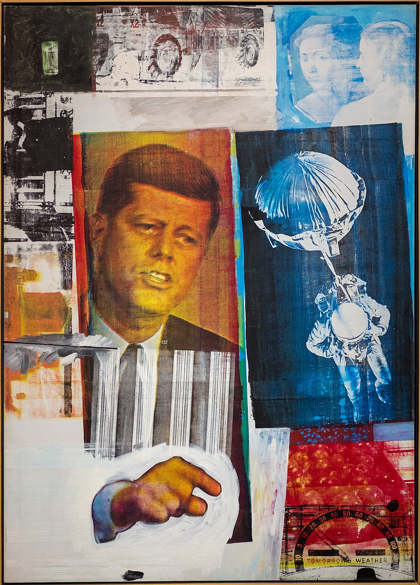

## 基本信息

- 作者：[[劳申伯格 Robert Rauschenberg]]
- 创作年代：1963
- 材质：（*not from wiki*）丝网印刷 + 油画综合材料
- 尺寸：（*not from wiki*）信息不全
- 现存地：（*not from wiki*）信息不全

## 画面与技法

劳申伯格 1960 年代的"丝网印刷绘画"系列之一——把照片、新闻图像、广告画通过 [[丝网印刷 Silkscreen]] 转印到画布上，再叠加油画笔触。**形式上接近 [[安迪·沃霍尔 Andy Warhol]]，逻辑上却归属于 [[杜尚 Marcel Duchamp]] 反艺术**——这正是顾衡 098 拒绝把劳申伯格归入 [[波普艺术 Pop Art]] 的原因。

## 历史背景 (*not from wiki*)

- 劳申伯格 1962 起开始使用丝网印刷，这与沃霍尔几乎同时——但两人的出发点完全不同。
- 同一年（1963）他还创作了著名的《Retroactive I》（含肯尼迪头像）。

## 图片清单

| 编号 | 出自 | 描述 |
|---|---|---|
| 01 | [[098｜波普艺术：流行文化如何成为艺术？]] | 作品全图 |

## 出现在

- [[098｜波普艺术：流行文化如何成为艺术？]]
