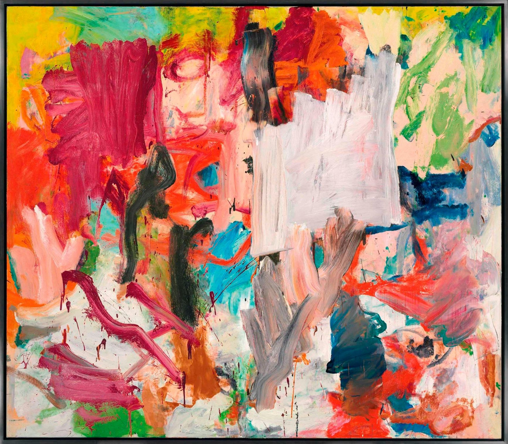

## 基本信息

- 作者：[[德·库宁 Willem de Kooning]]
- 创作年代：1977
- 材质：布面油画 (*not from wiki*)
- 现存地：私人收藏 (*not from wiki*)

## 画面与技法

德·库宁 1970 年代后期 **无题** 系列作品。延续 [[无题五 (德·库宁) Untitled V]] 的语言——厚涂、刮抹、大色块——但画面更松散、笔触更自由，已接近 1980 年代极简抽象风格的过渡。本讲（097）作为德·库宁晚期代表作之一出现。

## 图片清单

| 编号 | 出自 | 描述 |
|---|---|---|
| 01 | [[097｜德·库宁：抽象表现主义追求什么？]] | 暖色与冷色色块的松散组合，笔触自由 |

## 出现在

- [[097｜德·库宁：抽象表现主义追求什么？]] — 1970s 后期晚期抽象代表
