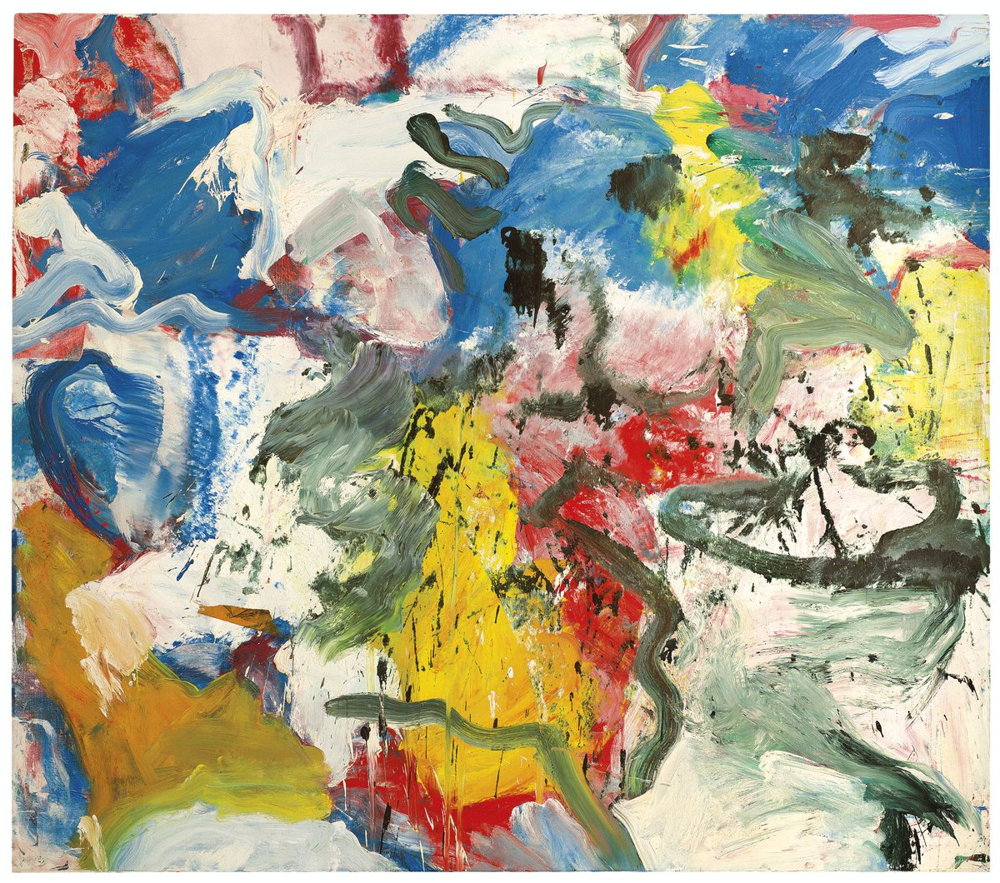

## 基本信息

- 作者：[[德·库宁 Willem de Kooning]]
- 创作年代：1975
- 材质：布面油画 (*not from wiki*)
- 现存地：私人收藏 (*not from wiki*)

## 画面与技法

德·库宁 1970 年代中期 **无题** 系列作品——回归更纯粹的抽象表达；色彩与笔触饱满、肌理厚重，是其晚期画风的代表。本讲（097）作为德·库宁后期作品出现，说明他即便在波洛克死后"心里一辈子没有放下波洛克"的复杂心境下，仍在持续创作。

## 图片清单

| 编号 | 出自 | 描述 |
|---|---|---|
| 01 | [[097｜德·库宁：抽象表现主义追求什么？]] | 大块暖色与冷色交织，笔触刮抹厚重，整体接近完全抽象 |

## 出现在

- [[097｜德·库宁：抽象表现主义追求什么？]] — 1970s 中期晚期抽象代表
