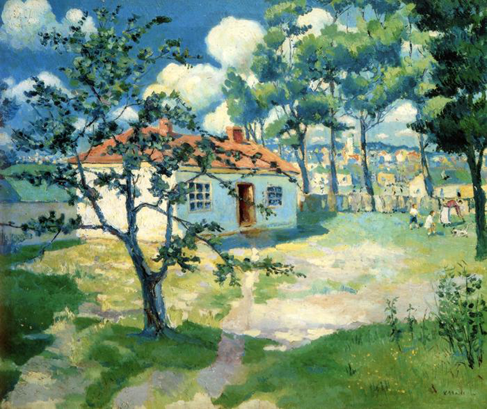

## 基本信息

- 作者：[[马列维奇 Kazimir Malevich]]
- 创作年代：1905
- 材质：布面油画 (*not from wiki*)
- 尺寸：年代不详 (*not from wiki*)
- 现存地：私人收藏 (*not from wiki*)

## 画面与技法

顾衡 083：本作"用 [[平行笔触 Parallel Brushstrokes|平行小笔触]] 来表现树木，这个技法当然是来自 [[塞尚 Paul Cézanne]]"——是 [[马列维奇 Kazimir Malevich]] 后印象派阶段倾向 [[塞尚 Paul Cézanne]] 的代表。

## 图片清单

| 编号 | 出自 | 描述 |
|---|---|---|
| 01 | [[083｜马列维奇：什么是至上主义？]] | 全画 |

## 出现在

- [[083｜马列维奇：什么是至上主义？]]
