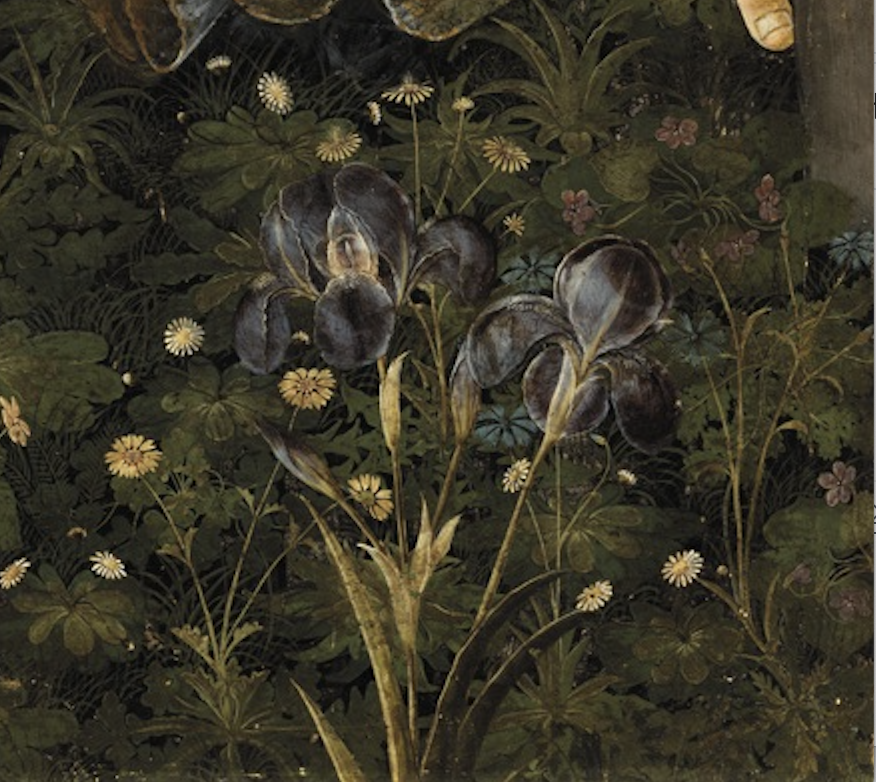
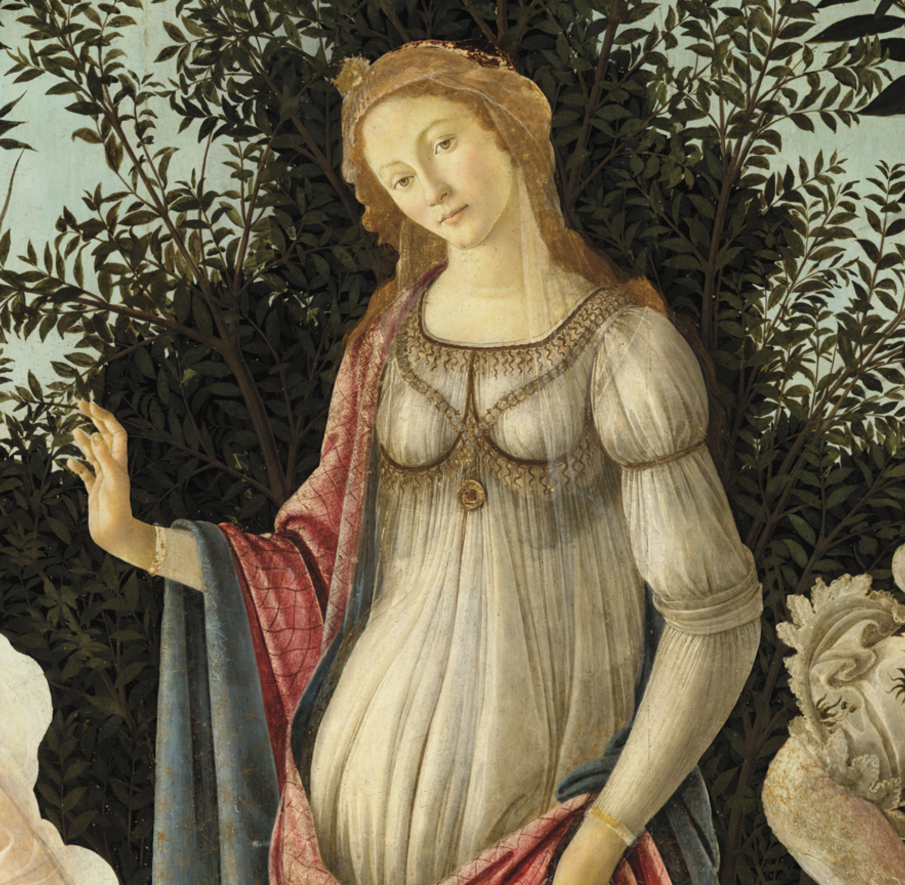
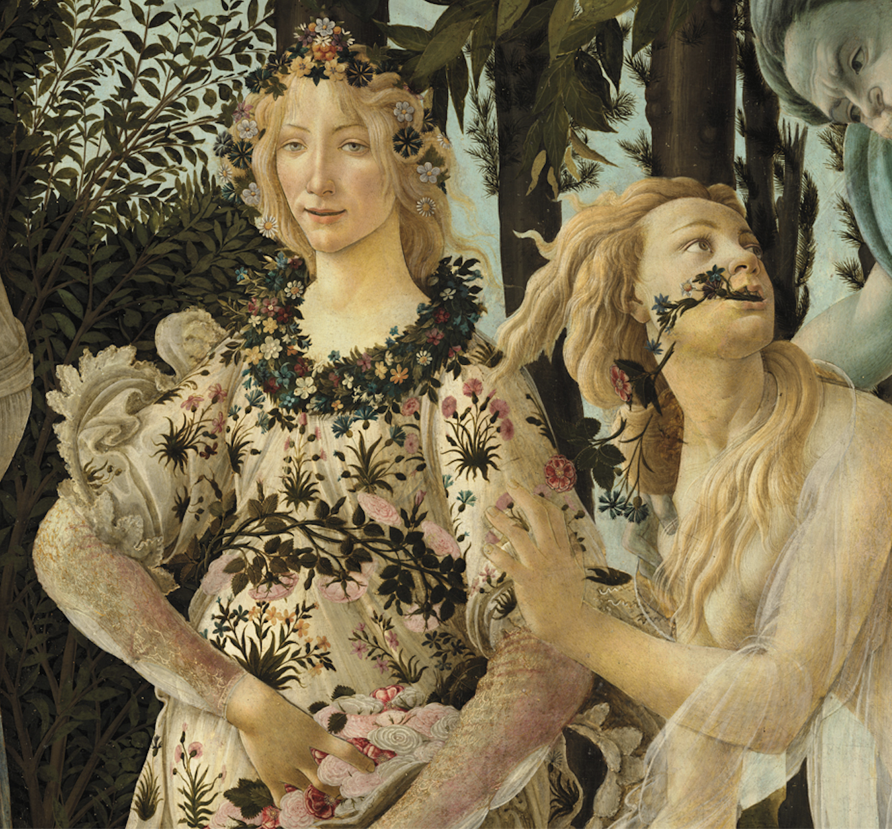

## 基本信息

- 作者：[[波蒂切利 Botticelli]]
- 创作年代：1481–1482 (*not from wiki*)
- 材质：木板蛋彩
- 尺寸：207 × 319 cm (*not from wiki*)
- 现存地：佛罗伦萨乌菲齐美术馆 (Galleria degli Uffizi)

## 画面与技法

中央偏右站着 [[新柏拉图主义 Neoplatonism]] 的化身——**维纳斯**（小腹隆起，有孕在身），头顶丘比特用箭指向左侧的美慧三女神。整幅画共九人，从左到右：

| 位置 | 人物 | 意义 |
|---|---|---|
| 最左 | 墨丘利 (Mercury) | 用手杖赶走不识相的乌云 |
| 左前 | 美慧三女神 (The Three Graces) | 翩翩起舞，喻意青春、美丽、欢乐 |
| 中央 | 维纳斯 + 头顶丘比特 | 主神；丘比特把爱情洒向人间 |
| 右前 | 春之女神 (Primavera) | 撒花 |
| 右 | 花神弗洛拉 (Flora) | 受西风神拥抱后从口中吐花 |
| 最右 | 西风神泽费罗斯 (Zephyrus) | 蓝绿色，带春风 |

**主题**——典出古罗马诗人 卢克莱修 (*De rerum natura*, "维纳斯缓缓前行，如皇后般庄严，她走过的路，万物萌芽生长。")

**右下角的菖蒲** —— 这是一幅**结婚画**，洛伦佐为侄子 Lorenzo di Pierfrancesco 订婚而画。

**两个细节**：

1. **维纳斯举右手** —— 中世纪绘画"有话要说"的姿势。她小腹隆起暗示有孕。学者解读不一：（a）祝愿新人早生贵子；（b）维纳斯是圣母玛利亚的化身，在异教神祇中宣告基督的即将到来——后一种解读有过度诠释嫌疑，存疑。
2. **千人一面** —— 除主角维纳斯外，美慧三女神、春之女神、花神 容貌**高度雷同、五官无个性**。这体现 柏拉图 对艺术的态度——反对变化、反对表现个性。在《法律篇》中柏拉图说："埃及人……画匠被禁止任何形式的创新……一万年前的作品不比现在好也不比现在坏。" 这是 [[理念美 Idea of Beauty]] 千人一面代价的最直接案例。

## 历史背景

(*not from wiki*) 洛伦佐·迪·皮耶尔弗朗西斯科·美第奇 (Lorenzo di Pierfrancesco de' Medici, 洛伦佐的侄子) 婚事订下后委托。模特为 西蒙内塔·维斯普奇（佛罗伦萨第一美女，1476 年 23 岁早逝；本画作于她死后 5–6 年）。原置维勒 di Castello（美第奇家族别墅）。

## 图片清单

| 编号 | 出自 | 描述 |
|---|---|---|
| 01 | [[009｜波蒂切利：如何解读"理念美"？]] | 整体图 |
| 02 | [[009｜波蒂切利：如何解读"理念美"？]] | 局部：右下角菖蒲（结婚画的线索） |
| 03 | [[009｜波蒂切利：如何解读"理念美"？]] | 局部：维纳斯，举右手、小腹隆起 |
| 04 | [[009｜波蒂切利：如何解读"理念美"？]] | 局部 |
| 05 | [[009｜波蒂切利：如何解读"理念美"？]] | 局部 |
| 06 | [[017｜科雷乔：为什么他是文艺复兴最具现代性的画家？]] | 整体图（用作"用树林挡远景"解决景深难题的例证） |

## 出现在

- [[009｜波蒂切利：如何解读"理念美"？]]
- [[017｜科雷乔：为什么他是文艺复兴最具现代性的画家？]]（波蒂切利"树林挡远景"应对景深难题）
