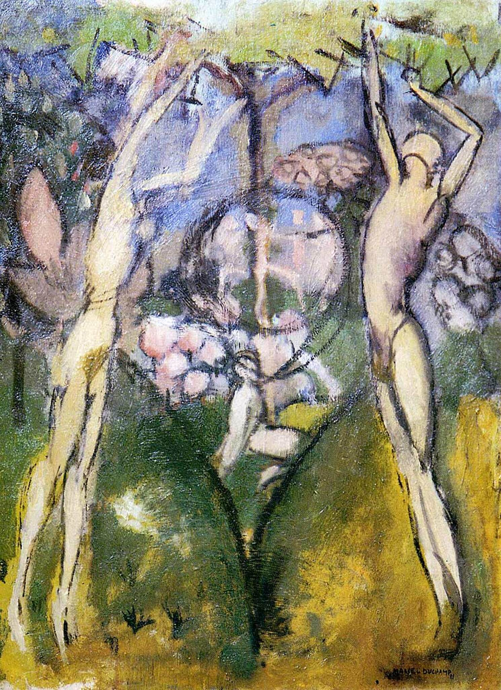

## 基本信息

- 作者：[[杜尚 Marcel Duchamp]]
- 创作年代：1911
- 材质：油画 (*not from wiki*)
- 尺寸：约 65.7 × 50.2 cm (*not from wiki*)
- 现存地：阿罗约-奥洛盖尔藏 / Arturo Schwarz 收藏旧藏 (*not from wiki*)

## 画面与技法

本讲（088）作为杜尚 1911 年[[分析立体主义 Analytical Cubism]]期作品之一与《[[灌木丛 (杜尚) The Bush]]》并列出场。1911 年的画面延续 [[X 射线 X-ray]] 母题以及"追求 [[象征主义 Symbolism]] 式的寓意"——杜尚画画"追求的不是视觉效果，而是观念"，这是日后他走向反艺术 / 观念艺术的伏笔。

## 历史背景

(*not from wiki*) 此画后来被认为是杜尚送给妹妹苏珊娜的结婚礼物；也常被研究者视作其后期"新娘"题材（如《[[从处女到已婚妇女的过程 The Passage from Virgin to Bride]]》、《[[大玻璃 The Large Glass]]》(*not from wiki*：待 ingest)）的早期种子。

## 图片清单

| 编号 | 出自 | 描述 |
|---|---|---|
| 01 | [[088｜杜尚1：他"好好画画"是什么样子的？]] | 整体图——分析立体主义寓意人物 |

## 出现在

- [[088｜杜尚1：他"好好画画"是什么样子的？]]
