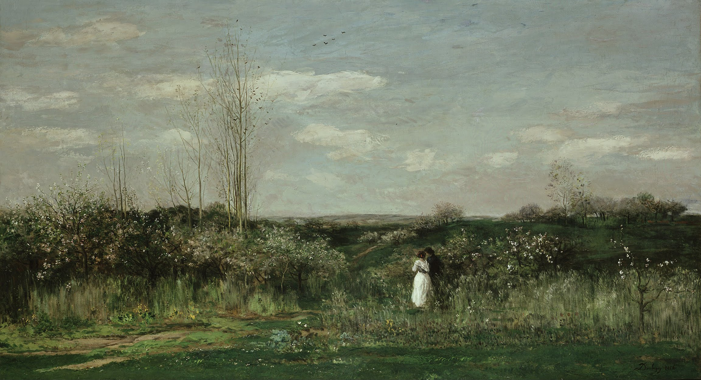

## 基本信息

- 作者：[[杜比尼 Charles-François Daubigny]]
- 创作年代：1862（041 caption）
- 材质：(*not from wiki*) 布面油画
- 尺寸：(*not from wiki*)
- 现存地：(*not from wiki*) —— 一说巴黎奥赛博物馆

## 画面与技法

041 出现的杜比尼风景画。041 顾衡用本作论证："**杜比尼是个粗犷派，也就是说，他喜欢像 [[伦勃朗 Rembrandt]] 一样的厚涂，喜欢在画面上留下鲜明的笔触，而不是像 [[柯罗 Camille Corot]] 那样有意把笔触掩藏起来。**" 厚涂 + 留笔触是日后 [[印象派 Impressionism]] 画法的直接技术源头。

## 历史背景

(*not from wiki*) 1860 年代杜比尼已经离开了巴比松村，转向塞纳河上的画船工作室（"Le Botin"）作画——是早期"户外完成作品"实验者之一。

041 顾衡明示其在印象派源头中的地位："**对莫奈影响最大的巴比松画家，却是当时已经离开巴比松的画家杜比尼**"。

## 图片清单

| 编号 | 出自 | 描述 |
|---|---|---|
| 01 | [[041｜莫奈1：颠覆式的创新从何而来？]] | 春天乡村景色 |

## 出现在

- [[041｜莫奈1：颠覆式的创新从何而来？]]
