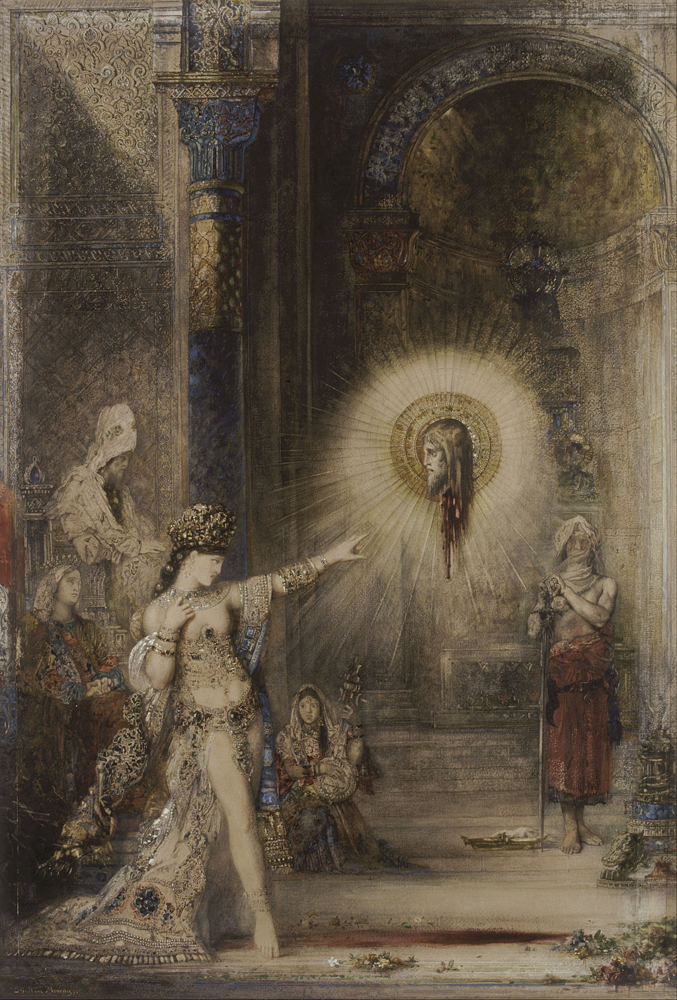

## 基本信息

- 作者：[[莫罗 Gustave Moreau]]
- 创作年代：1874–1876
- 材质：水彩 / 纸本 (*not from wiki*)
- 尺寸：106 × 72.2 cm (*not from wiki*)
- 现存地：(*not from wiki*) 法国 卢浮宫 Musée du Louvre, Paris

## 画面与技法

莫罗 [[莎乐美 Salome]] 母题中**最著名**的一幅——画面中央**漂浮的施洗者约翰头颅**在血光环绕中向莎乐美"显灵"凝视；莎乐美半裸、装饰繁复，向头颅伸手指。这一**"漂浮的头颅"** 意象**完全脱离了《圣经》文本**——文本里约翰的头是被装在盘子里端上来的——莫罗用"显灵"瞬间把整个事件神秘化、奇幻化，使画面从叙事变为视觉幻象。这是 [[象征主义 Symbolism]] **朦胧路径**最极端的形态：放弃文本忠实、把抽象观念（罪、欲望、报应、神圣审判）压缩成一个超现实图像。

## 历史背景

(*not from wiki*) 1876 年首展轰动一时，与《[[在希律王前舞蹈的莎乐美 Salome Dancing before Herod]]》同台展出，构成莫罗"莎乐美主题"双联。本作直接启发了 1891 年王尔德（Oscar Wilde）的戏剧《莎乐美》（*Salomé*）—— 王尔德剧中莎乐美对约翰说："**亲爱的，我真的很爱你，我会永远爱你。但首先，我要杀了你。**"（顾衡 050 评："王尔德真是太懂莫罗了。"）

## 图片清单

| 编号 | 出自 | 描述 |
|---|---|---|
| 01 | [[050｜莫罗：象征主义绘画为什么走向朦胧？]] | 1874–1876 全图——漂浮显灵的约翰头颅与莎乐美对视 |

## 出现在

- [[050｜莫罗：象征主义绘画为什么走向朦胧？]]
