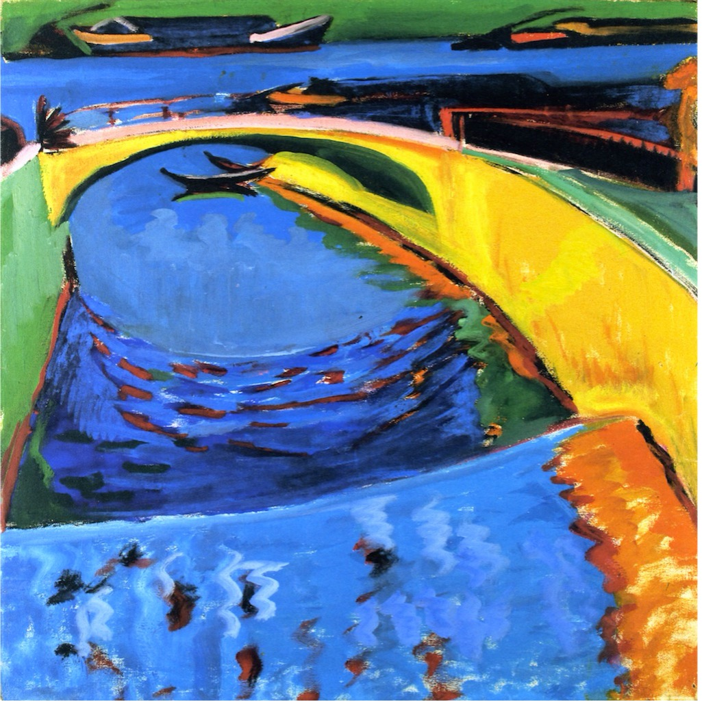

## 基本信息

- **作者**：[[基希纳 Ernst Ludwig Kirchner]]
- **创作年代**：约 1910
- **材质**：布面油画 (*not from wiki*)
- **尺寸**：暂不详 (*not from wiki*)
- **现存地**：暂不详 (*not from wiki*)

## 画面与技法

- 072 与 [[布格斯他肯港口 (基希纳) Burgstaaken Harbour]] 同组出现，作为基希纳"哥特式高耸建筑、北方阴郁景观"系列的早期代表。
- 创作时期正值 [[桥社 Die Brücke]] 在德累斯顿的最活跃年份（普利斯尼茨河 Prießnitz 是流经德累斯顿的小河支流）。

## 历史背景 (*not from wiki*)

约 1910 年的桥社时期作品——基希纳此时正吸收 [[爱德华·蒙克 Edvard Munch]] 与 [[马蒂斯 Henri Matisse]] 的双重影响，构建后续柏林街景系列的造型语言。

## 图片清单

| 编号 | 出自 | 描述 |
|---|---|---|
| 01 | [[072｜桥社：什么是表现主义绘画的使命？]] | Bridge at the Mouth of the Priessnitz ~1910 |

## 出现在

- [[072｜桥社：什么是表现主义绘画的使命？]]
