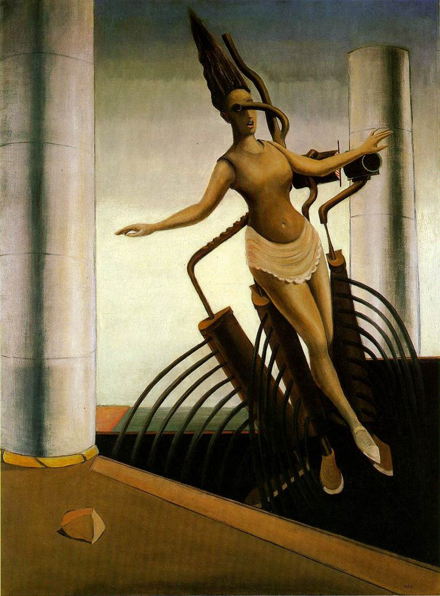

## 基本信息

- 作者：[[恩斯特 Max Ernst]]
- 创作年代：1923
- 材质：布面油画 (*not from wiki*)
- 现存地：杜塞尔多夫艺术宫 K20 (Kunstsammlung Nordrhein-Westfalen) (*not from wiki*)

## 画面与技法

恩斯特初到巴黎、深受 [[艾吕雅 Paul Éluard]] 影响时期的代表作之一。属于"用 **诗意** 替代潜意识"的实践——画面中各自独立的元素**毫无关联**，通过模仿 [[洛特雷阿蒙 Comte de Lautréamont]]"缝纫机与雨伞在解剖台上的偶然相遇"的错位搭配来营造诗意。

恩斯特本人否认这些元素可以被精神分析式地一一释义——"用精神分析那一套来解读他的作品，肯定是胡说八道"。

## 图片清单

| 编号 | 出自 | 描述 |
|---|---|---|
| 01 | [[093｜契里柯与恩斯特：如何用绘画表现超现实主义？]] | 工业室内空间中的机械装置与人形元素并置，多个独立物象在画面中错位组合 |

## 出现在

- [[093｜契里柯与恩斯特：如何用绘画表现超现实主义？]] — 恩斯特"诗意路径"早期代表作
