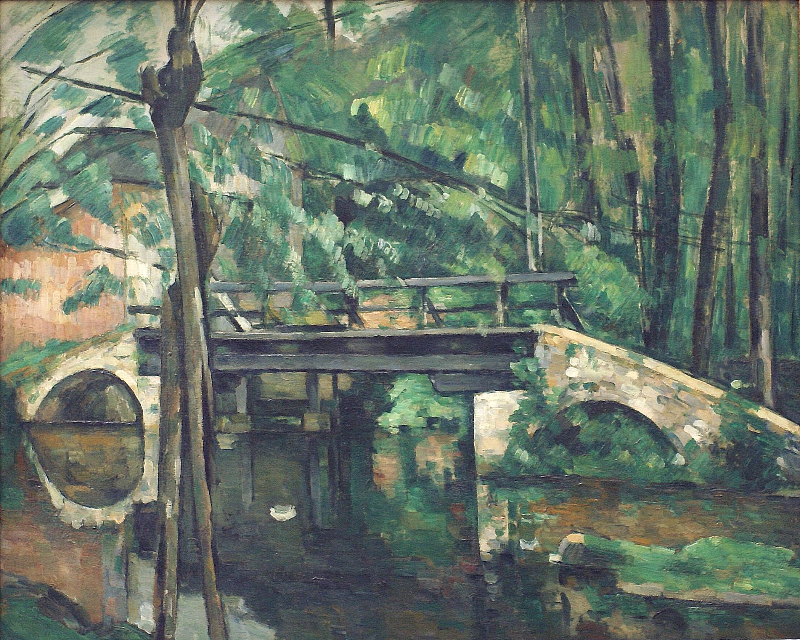

## 基本信息

- 作者：[[塞尚 Paul Cézanne]]
- 创作年代：1882（顾衡 053 标注；现传通常注 1879-1880 (*not from wiki*)）
- 材质：油彩，画布 (*not from wiki*)
- 尺寸：(*not from wiki*) 58.5 × 72.5 cm
- 现存地：(*not from wiki*) 奥赛博物馆，巴黎

## 画面与技法

[[塞尚 Paul Cézanne]] **平行短笔触方向性**的范例——顾衡 053 用本作论证塞尚的"彩色素描"造型法：

- **树木**的笔触：**垂直或对角线方向**
- **水面反光**的笔触：**平行**

塞尚的小笔触"**都是短的直线条、而且严格平行**"——区别于 [[莫奈 Claude Monet]]、[[毕沙罗 Camille Pissarro]] 那种"跟布朗运动似的"印象派笔触（形状各异、无方向、不许有线条）。塞尚的策略是：在一个块面里笔触彼此平行，不同块面之间笔触产生不同角度，**形成整体韵律 / 应和关系**。

**与德拉克罗瓦的关键区别**——见 [[萨尔丹纳帕拉之死 The Death of Sardanapalus]]：[[德拉克罗瓦 Eugène Delacroix]] 的平行笔触**方向与轮廓平行**（服务造型），而塞尚的笔触**方向与对象轮廓无关**（服务块面间应和）。

这就是塞尚把笔触理解为"**彩色的素描**"的核心——笔触不再附着于对象，而是独立的**造型手段**。

## 历史背景 (*not from wiki*)

Maincy 在巴黎东南约 50 公里、Melun 附近的小镇，塞尚 1879-1880 间逗留期间所画。本作日后被视为塞尚"建构性时期 (constructive period)" 的代表之一。

## 图片清单

| 编号 | 出自 | 描述 |
|---|---|---|
| 01 | [[053｜塞尚2：如何打造艺术的平行世界？]] | 全图——平行短笔触方向性范例 |

## 出现在

- [[053｜塞尚2：如何打造艺术的平行世界？]] —— 平行短笔触作为"彩色素描"的核心证据
