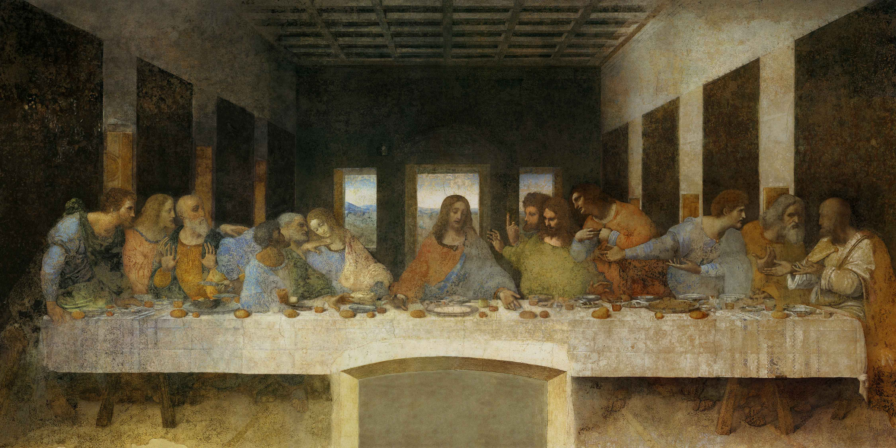

## 基本信息

- 作者：[[达·芬奇 Leonardo da Vinci]]
- 创作年代：1495–1498 (*not from wiki*)
- 材质：蛋彩与油彩混合在干石膏墙上 (tempera and oil on dry plaster) —— 即"在 fresco 该用的位置用了非 fresco 技法" (*not from wiki*)
- 尺寸：460 × 880 cm (*not from wiki*)
- 现存地：米兰圣母感恩堂 (Santa Maria delle Grazie) 食堂北墙 (*not from wiki*)

## 画面与技法

13 人长桌横向构图。耶稣居中，向左右各 6 位门徒以 "三人一组" 切成四组。"我说你们之中有一人要出卖我"刚刚说出口，画面捕捉的是这句话激起的瞬时反应——犹大一只手向后缩并掩着自己的钱袋。透视消失点设于耶稣面部，整幅墙成了食堂的视觉延伸。(*not from wiki*)

## 历史背景

(*not from wiki*) 通常壁画用 fresco——颜料涂在湿石膏上，干燥后颜料与石膏融为一体，极耐久；缺点是必须在石膏干硬前完成、不能反复修改。达·芬奇追求层次细腻的明暗 (sfumato)，需要长时间反复推敲，所以**放弃 fresco，改用油彩与蛋彩混合在干石膏上**——这种附着方式从一开始就不稳定，画完几年就开始剥落、变黑。

顾衡在 [[001｜总导论：艺术到底属于谁？]] 用它作为艺术史"关注质料与技术"路径的代表案例：要解释画面为什么大面积发黑剥落，必须回到达·芬奇当年那个**违反 fresco 规范**的技术选择。

关于本作的更完整解读（构图、人物心理、宗教语境）将留待 [[010｜达芬奇：他为什么一生抑郁不得志？]] 处理。

## 图片清单

| 编号 | 出自 | 描述 |
|---|---|---|
| 01 | [[001｜总导论：艺术到底属于谁？]] / [[010｜达芬奇：他为什么一生抑郁不得志？]] | 整体图（两课配图 MD5 相同） |
| 02 | [[017｜科雷乔：为什么他是文艺复兴最具现代性的画家？]] | 整体图（论阿恩海姆"目光像机枪"：定睛看基督时近在咫尺的犹大无法真正看到） |

## 出现在

- [[001｜总导论：艺术到底属于谁？]]（"质料与技术"路径案例）
- [[010｜达芬奇：他为什么一生抑郁不得志？]]（米兰 17 年六幅画之一；油画在干石膏上的技术违规导致后世剥落）
- [[017｜科雷乔：为什么他是文艺复兴最具现代性的画家？]]（几何透视假定一只眼睛 + 阿恩海姆"机枪目光"论的代表）
