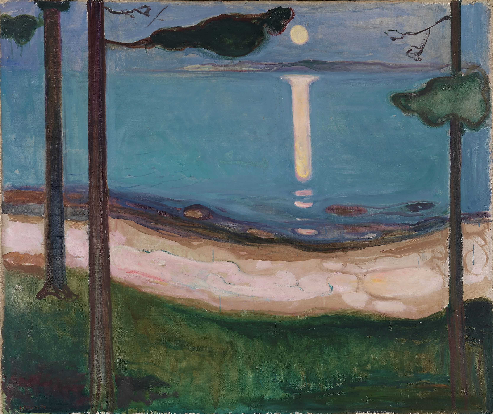

## 基本信息

- 作者：[[爱德华·蒙克 Edvard Munch]]
- 创作年代：1895
- 材质：布面油画 (*not from wiki*)
- 尺寸：未注明
- 现存地：挪威国家博物馆 (*not from wiki*)

## 画面与技法

一位女子静立月光下，身后木屋阴影投在墙面——蒙克 [[爱组画 The Frieze of Life]] 中的**"夏夜女子"**子母题，与 [[仲夏夜 Summer Night in Studenterlunden]] 共享**北方哥特风**式阴暗、静谧、超现实的氛围（顾衡 070）。

## 历史背景 (*not from wiki*)

地点为奥斯陆峡湾沿岸 Åsgårdstrand，蒙克 1890s 夏季住所——本作与 1893 [[风暴 The Storm]]、1899 [[仲夏夜 Summer Night in Studenterlunden]] 共享同一组峡湾意象。

## 图片清单

| 编号 | 出自 | 描述 |
|---|---|---|
| 01 | [[070｜蒙克1：表现主义的先行者经历了什么？]] | 月光下侧立女子 + 木屋墙影 |

## 出现在

- [[070｜蒙克1：表现主义的先行者经历了什么？]]
