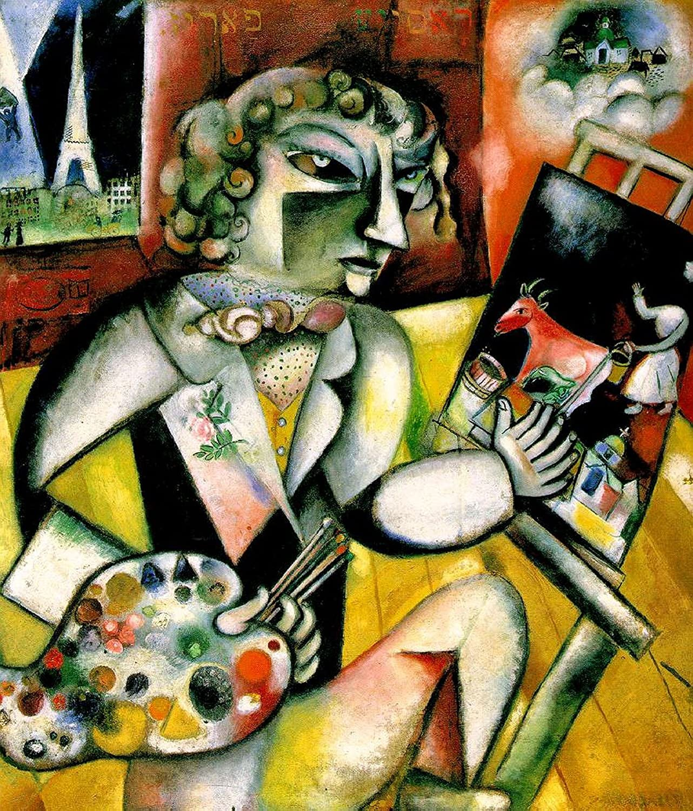

## 基本信息

- 作者：[[夏加尔 Marc Chagall]]
- 创作年代：1913
- 材质：布面油画 (*not from wiki*)
- 尺寸：约 128 × 107 cm (*not from wiki*)
- 现存地：阿姆斯特丹市立博物馆 (Stedelijk Museum) (*not from wiki*)

## 画面与技法

与 [[我和我的村庄 I and the Village]] **风格相似**——同样是**立体主义几何形状 + 野兽派鲜艳色彩**的搭配（顾衡 077）。

画面读解：

- **窗外**：巴黎的象征 **埃菲尔铁塔**
- **画家本人**正在画一头牛、**与它在无言中对视，分享着孤独和乡愁**
- 画家自画的左手**有七个手指**——夏加尔的解释："**这与犹太教的宗教仪式有关。**"

顾衡评：**犹太教的神秘教义，正是夏加尔幻想的宝库和源泉。** 夏加尔本人说："**我在生活中的唯一要求，不是努力接近伦勃朗、戈莱丁、丁托列托或者其他什么大师，而是努力接近我父辈和祖辈的精神。**"

## 历史背景 (*not from wiki*)

1913 年作于巴黎，处在夏加尔第一次巴黎期（1910–1914）的尾声。一年后他回俄国探亲，因一战滞留。窗外的埃菲尔铁塔与画中的牛形成"巴黎-维切布斯克"的双重所在。

## 图片清单

| 编号 | 出自 | 描述 |
|---|---|---|
| 01 | [[077｜夏加尔：俄国人在巴黎]] | 画家左手七指、窗外铁塔、画中牛 |

## 出现在

- [[077｜夏加尔：俄国人在巴黎]] —— 立体主义 + 野兽派的同款搭配；犹太教神秘教义的视觉化
