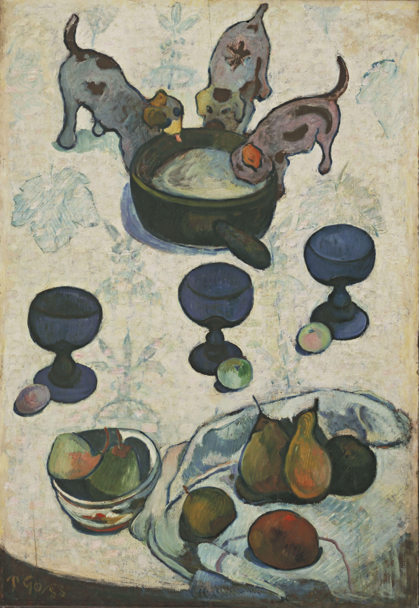

## 基本信息

- 作者: [[高更 Paul Gauguin]]
- 创作年代: 1888
- 材质: 布面油画 (*not from wiki*)
- 尺寸: 年代不详
- 现存地: (*not from wiki*) 现代艺术博物馆 MoMA，纽约（待核）

## 画面与技法

高更 1887 马提尼克之行后画风大变——[[毕沙罗 Camille Pissarro]]敏锐指出，这是"**对原始部落的文化进行了掠夺式的'借鉴'**"。顾衡 055 与《打干草》《三个跳舞的布列塔尼女孩儿》并列为这一论断的证据样本。

## 历史背景 (*not from wiki*)

1887 马提尼克之行带回的"原始视野"——形状简化 + 大色块 + 平面化处理；这是高更走向[[象征主义 Symbolism]] / 综合主义之前最重要的一步过渡。

## 图片清单

| 编号 | 出自 lecture | 描述 |
|---|---|---|
| 01 | [[055｜高更1：为什么从印象派走向象征主义？]] | 全图 |

## 出现在

- [[055｜高更1：为什么从印象派走向象征主义？]]
