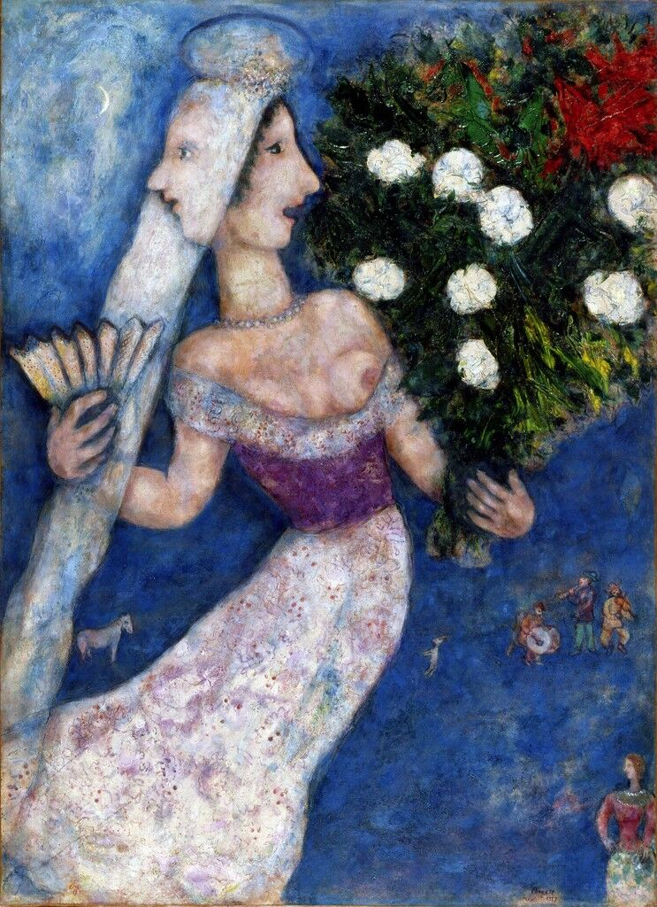

## 基本信息

- 作者：[[夏加尔 Marc Chagall]]
- 模特：[[贝拉·罗森菲尔德 Bella Rosenfeld]]
- 创作年代：1927
- 材质：布面油画 (*not from wiki*)
- 尺寸：年代不详 (*not from wiki*)
- 现存地：私人收藏 (*not from wiki*)

## 画面与技法

顾衡 077 列为夏加尔**以贝拉为题创作的代表作之一**——与 [[生日 (夏加尔) The Birthday]]、[[新婚 (夏加尔) The Promenade]]、[[埃菲尔铁塔下的新人 The Bride and Groom of the Eiffel Tower]] 并列。

标题中的"两张脸"是夏加尔常见的**视点叠加 / 时间叠加**技巧——同一个人物呈现多重面孔，呼应夏加尔本人的话："**只要一打开窗，她就在这里……从古老的时候起直至今日，她都翱翔于我的画中。**"

## 历史背景 (*not from wiki*)

1927 年作于巴黎，属夏加尔回到巴黎后**作品中梦境意味越来越明显**的时期（顾衡 077）。

## 图片清单

| 编号 | 出自 | 描述 |
|---|---|---|
| 01 | [[077｜夏加尔：俄国人在巴黎]] | 双面新娘——贝拉肖像组的重要一幅 |

## 出现在

- [[077｜夏加尔：俄国人在巴黎]] —— 贝拉肖像组代表作
