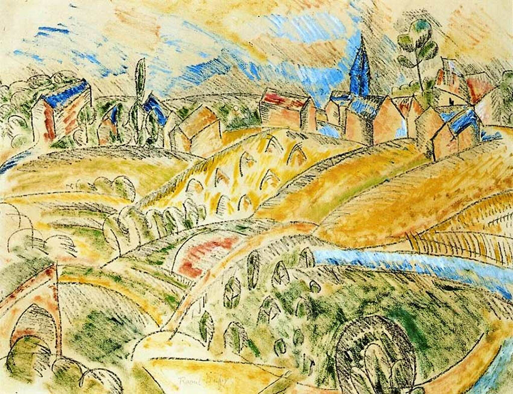

## 基本信息

- 作者：[[杜菲 Raoul Dufy]]
- 创作年代：1913
- 材质：油彩，画布 (*not from wiki*)
- 现存地：(*not from wiki*)

## 画面与技法

[[杜菲 Raoul Dufy]] 1913 年作品——**对立体主义的幽默嘲讽**。

顾衡 063 解读：[[杜菲 Raoul Dufy]] 1900 年代后期曾被同乡 [[勃拉克 Georges Braque]] 的立体主义吸引、一度尝试，"**但是很快他就觉得那种绘画并不属于自己**"。本作是他与立体主义的告别礼——把干草垛画成立体主义的方块嵌套，画面**自带戏谑感**，顾衡 063 评："我们看他《有草垛的立体主义风景》，就会哈哈大笑，这体现了杜菲的幽默和嘲讽"。

对杜菲而言，**用绘画来表达思想和理念的做法**是要不得的——他的纲领只有一句：**画得好看**。

## 历史背景 (*not from wiki*)

- 1913 立体主义已成为前卫艺术主流；杜菲不被吸引——他后来选择转向**装饰性+原始性**的杜菲式风格 ([[地中海居民 The Mediterraneans]]、[[考斯的帆船比赛 Regatta at Cowes]] 等)。
- 与 [[勃拉克 Georges Braque]]、[[弗里兹 Othon Friesz]] 同为 Le Havre (勒阿弗尔) 出身的 [[野兽派 Fauvism]] 第三小组——三人后来三个完全不同方向。

## 图片清单

| 编号 | 出自 | 描述 |
|---|---|---|
| 01 | [[063｜野兽派，除了马蒂斯还能谈什么？]] | 整幅画面——杜菲对立体主义的告别礼 |

## 出现在

- [[063｜野兽派，除了马蒂斯还能谈什么？]] —— 杜菲反理论、反立体主义的样本
