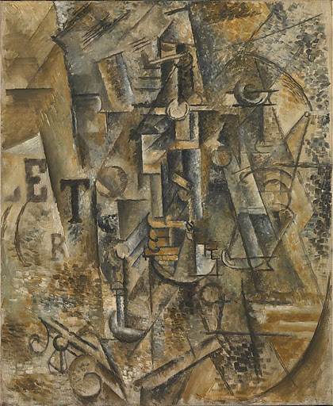

## 基本信息

- 作者：[[毕加索 Pablo Picasso]]
- 创作年代：1911
- 材质：布面油画 (*not from wiki*)
- 尺寸：61.3 × 50.5 cm (*not from wiki*)
- 现存地：纽约大都会艺术博物馆 The Met (*not from wiki*)

## 画面与技法

[[分析立体主义 Analytical Cubism]] 成熟期作品——

- 与肖像不同，画面**完全失去可辨识形体**，只剩交错切面的褐色调色板。
- 顾衡（066）以此作举证 [[分析立体主义 Analytical Cubism]] 第二条退路：**只画大家都非常熟悉的题材**（如酒瓶、乐器、女人）—— 即使形体砸碎到难以辨认，观众至少凭题材标签（"静物"）能锚定阅读方向。
- 与同年的《[[钢琴和手风琴家 The Piano Accordionist]]》、《[[葡萄牙人 The Portuguese]]》同属"把镜子打得更碎"的实验阶段。

## 历史背景 (*not from wiki*)

- 1911 年是 [[毕加索 Pablo Picasso]] 与 [[勃拉克 Georges Braque]] 分析立体主义合作最紧密的一年，两人作品风格几乎不可分辨、都不签名——"都是些小三角小圆圈，有啥区别呢？"
- 静物题材成为两人的共同试验场——把"已知物"砸成几何切面是分析立体主义的标准操作。

## 图片清单

| 编号 | 出自 | 描述 |
|---|---|---|
| 01 | [[066｜毕加索3：什么是分析立体主义？]] | 全图——熟悉题材作为辨识锚点 |

## 出现在

- [[066｜毕加索3：什么是分析立体主义？]] —— [[分析立体主义 Analytical Cubism]] "熟悉题材作锚点"路线代表
