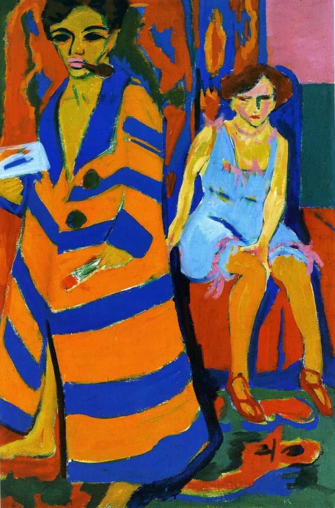

## 基本信息

- **作者**：[[基希纳 Ernst Ludwig Kirchner]]
- **创作年代**：1910
- **材质**：布面油画 (*not from wiki*)
- **尺寸**：约 150 × 100 cm (*not from wiki*)
- **现存地**：汉堡美术馆 Hamburger Kunsthalle (*not from wiki*)

## 画面与技法

- **072 中作为"马蒂斯影响"的关键例证**：**纯色条纹**所产生的强烈对比和**装饰性**——显然来自 [[马蒂斯 Henri Matisse]] / [[野兽派 Fauvism]]。
- **画面叙事**：画家自己**软弱**、**病怏怏**；身后的女人**乜斜着眼睛**看着他，"正在动什么坏脑筋"——072 引此画论证基希纳**对女性的恐惧和厌弃**。
- **冲击力**：这种"情绪 / 风格" 是基希纳要追求的效果——把 [[野兽派 Fauvism]] 的色彩自由扭向**北方哥特冷峻**、扭向**民族性**焦虑。

## 历史背景 (*not from wiki*)

1910 是 [[桥社 Die Brücke]] 在德累斯顿的盛期，也是基希纳从马蒂斯吸收纯色条纹语法、整合进自身造型偏好的转折之作。

## 图片清单

| 编号 | 出自 | 描述 |
|---|---|---|
| 01 | [[072｜桥社：什么是表现主义绘画的使命？]] | Self-Portrait with Model 1910 — 纯色条纹 + 病弱画家 + 戒备模特 |

## 出现在

- [[072｜桥社：什么是表现主义绘画的使命？]]
