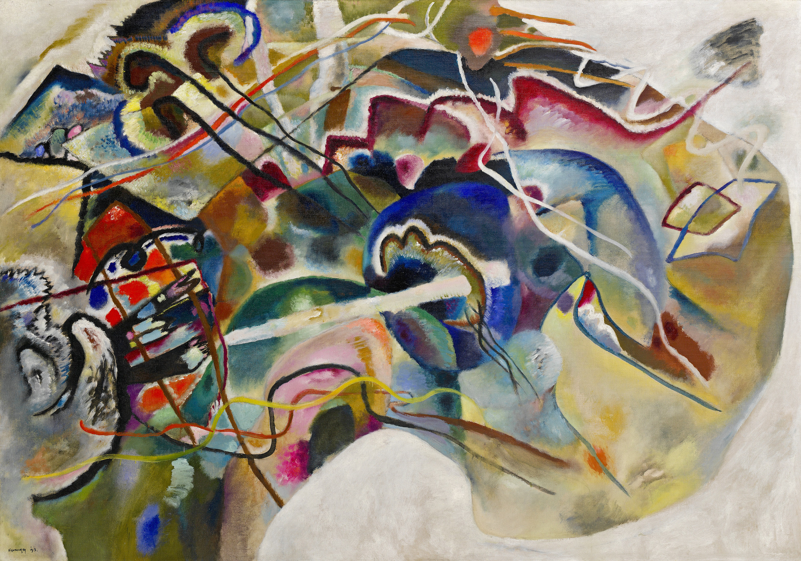

## 基本信息

- 作者：[[康定斯基 Wassily Kandinsky]]
- 创作年代：1913
- 材质：布面油画 (*not from wiki*)
- 尺寸：约 140 × 200 cm (*not from wiki*)
- 现存地：纽约古根海姆美术馆 (Solomon R. Guggenheim Museum, New York) (*not from wiki*)

## 画面与技法

顾衡 082 把本画作为康定斯基"事后解释破坏抽象"的关键例证：

- 左上指向中心的**三条黑线** → 康定斯基自释为"**俄罗斯的三套马车**"
- 中间最显眼的**白色长条** → 自释为"**一把剑**"
- 长剑刺向左下角的"**恶龙**"

顾衡评："**你看，又是马车又是龙的，热闹得狠**——这就不能算完全的抽象了。"

这种**事后解释的习惯**是 1912 年之后康定斯基"抽象不彻底"的实践表征；要等到一战结束后他才放弃。

## 图片清单

| 编号 | 出自 | 描述 |
|---|---|---|
| 01 | [[082｜康定斯基2：他为什么走向抽象？]] | "三套马车 + 长剑 + 恶龙"事后解释的画 |

## 出现在

- [[082｜康定斯基2：他为什么走向抽象？]]
