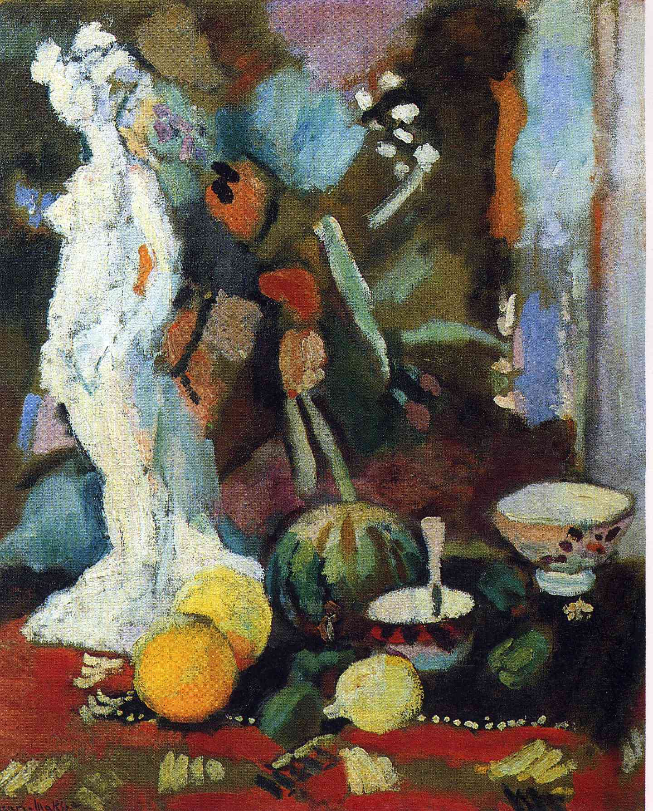

## 基本信息

- 作者：[[马蒂斯 Henri Matisse]]
- 创作年代：1906
- 材质：油画 (*not from wiki*)
- 尺寸：(*not from wiki*)
- 现存地：(*not from wiki*)

## 画面与技法

062 援引此画作为"**野兽派拼盘期**"的样本——以相对独立的线条和色块作为材料，来"搭建"结构的思路。

顾衡定性："**之前野兽派的作品，说白了是个拼盘，既有 [[塞尚 Paul Cézanne]] 的 [[分节 (塞尚) Passage]] 概念，也有 [[象征主义 Symbolism]] 的简化，最后还有对非欧洲艺术的各种借鉴。**"

在 [[贝伦森 Bernard Berenson]] 把 [[柏格森 Henri Bergson]] 的 [[生命哲学 Philosophy of Life]] 引入之前，马蒂斯的创作就是这种**拼盘式状态**——本作即典型。

## 历史背景 *(not from wiki)*

1906 年正值野兽派得名后的高峰期（1905 秋季沙龙、1906 三月马蒂斯个展 55 幅几乎全卖光），但理论包装尚未到位——本作处在"野兽派 → 柏格森式自觉"的过渡前夜。

## 图片清单

| 编号 | 出自 | 描述 |
|---|---|---|
| 01 | [[062｜马蒂斯3：如何理解他一生的创作？]] | 静物全景 |

## 出现在

- [[062｜马蒂斯3：如何理解他一生的创作？]] —— 野兽派拼盘期样本
