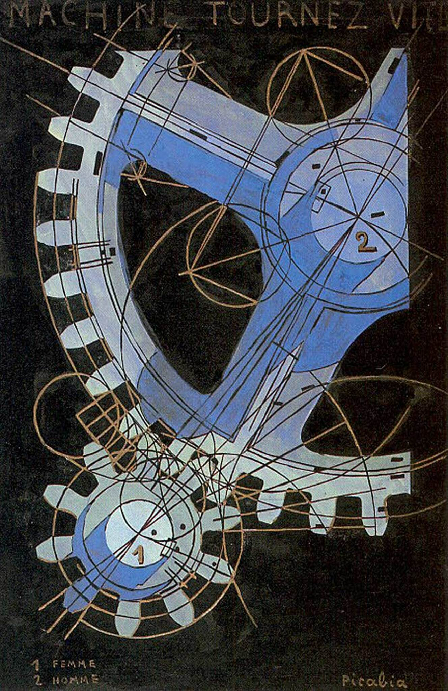

## 基本信息

- 作者：[[毕卡比亚 Francis Picabia]]
- 创作年代：1916–1918
- 材质：纸面油画 / 水粉 (*not from wiki*)
- 尺寸：约 49.5 × 32.5 cm (*not from wiki*)
- 现存地：私人收藏 (*not from wiki*)

## 画面与技法

[[毕卡比亚 Francis Picabia]] **达达"机器画女人"期**作品——用旋转的机械齿轮、传动轴等图样作为人体 / 性的隐喻。

毕卡比亚对自己这类作品的"正经回答"是："机器已不再是人类生活的附属品，而是人类生活真正的部份，甚至可以说是生活的灵魂……机器是人类没有母亲的女儿。" 顾衡的评注："他的这些话，你一个字都别信，就对了。"

## 历史背景

(*not from wiki*) 1916–1918 跨越一战末期；毕卡比亚此时在纽约与杜尚一同搞达达。

## 图片清单

| 编号 | 出自 | 描述 |
|---|---|---|
| 01 | [[091｜毕卡比亚：如何用绘画表现达达主义？]] | 整体图 — 机械齿轮的旋转 |

## 出现在

- [[091｜毕卡比亚：如何用绘画表现达达主义？]]
