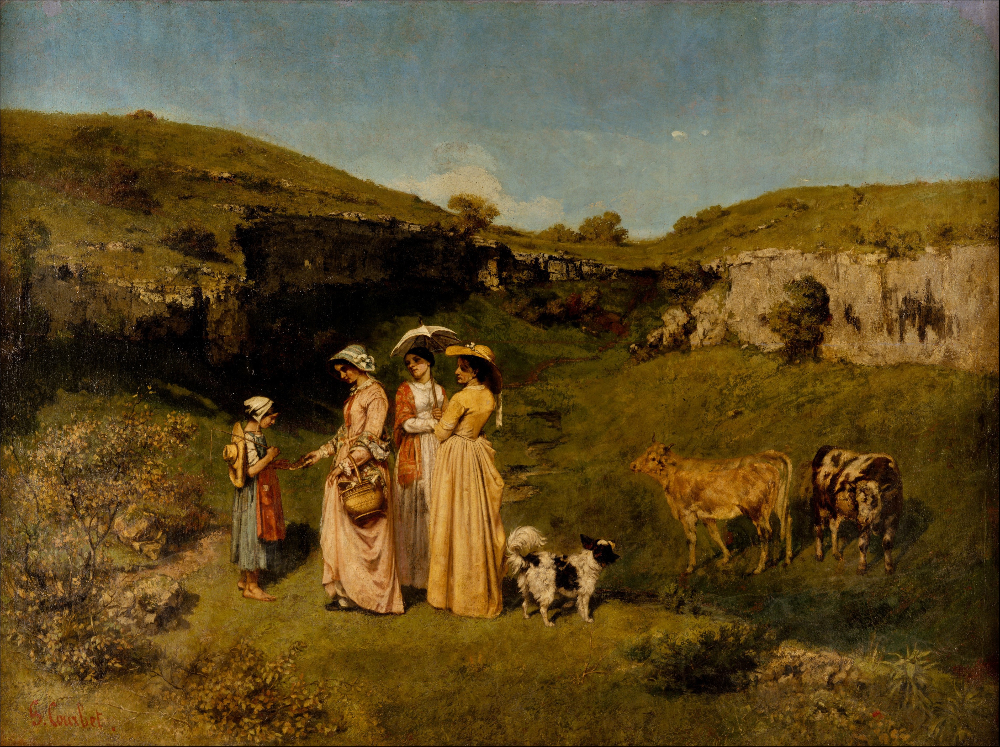

## 基本信息

- 作者：[[居斯塔夫·库尔贝 Gustave Courbet]]
- 创作年代：1851
- 材质：布面油画 (*not from wiki*)
- 尺寸：约 195 × 261 cm (*not from wiki*)
- 现存地：纽约大都会艺术博物馆 Metropolitan Museum of Art, New York (*not from wiki*)

## 画面与技法

三位库尔贝的姐妹身穿城里人样式的礼服，在奥尔南附近的山谷给一位赤脚的放牛女孩儿施舍。学院派的题材常规是神话英雄；本作把当下乡村慈善 / 阶级差别**直接搬上沙龙级大画布**。

## 历史背景

**1852 年政府红人莫尔尼公爵 (Duc de Morny) 买下此画**（顾衡 035 明示）—— 这一笔交易让库尔贝**暂时稳住了情绪**，没有立刻投入更激进的反叛。这是 1850 代初**官方与库尔贝之间最高 / 短暂的和解**。

## 图片清单

| 编号 | 出自 | 描述 |
|---|---|---|
| 01 | [[035｜库尔贝：为什么现实主义的开创者争议那么大？]] | 三女士施舍放牛女孩 |

## 出现在

- [[035｜库尔贝：为什么现实主义的开创者争议那么大？]]
