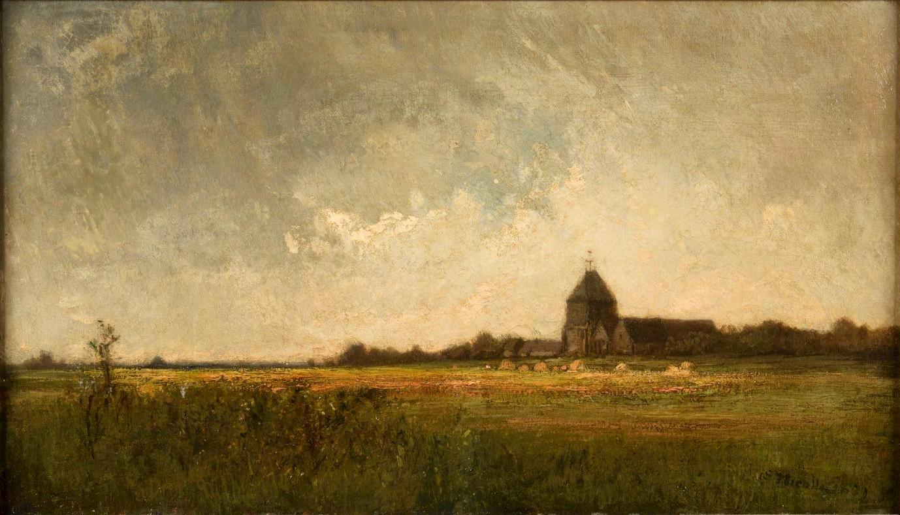

## 基本信息

- 作者：[[尼科尔 Émile Frédéric Nicolle]]
- 创作年代：1889
- 材质：油画 (*not from wiki*)
- 尺寸：未知
- 现存地：未知 (*not from wiki*)

## 画面与技法

[[杜尚 Marcel Duchamp]] 外祖父的风景画。本讲（088）作为"杜尚艺术细胞家学渊源"的物证出场——尼科尔靠货运代理发财后早早退休、一门心思画画，作品曾入选官方 [[巴黎沙龙 Paris Salon]]，被顾衡评为"非常不错的风景画家"。

## 历史背景

(*not from wiki*) 19 世纪末法国 [[巴黎沙龙 Paris Salon]] 入选画家的典型构图——介于学院派与外光绘画之间的稳健风景。

## 图片清单

| 编号 | 出自 | 描述 |
|---|---|---|
| 01 | [[088｜杜尚1：他"好好画画"是什么样子的？]] | 整体图——尼科尔家学传统的物证 |

## 出现在

- [[088｜杜尚1：他"好好画画"是什么样子的？]]
