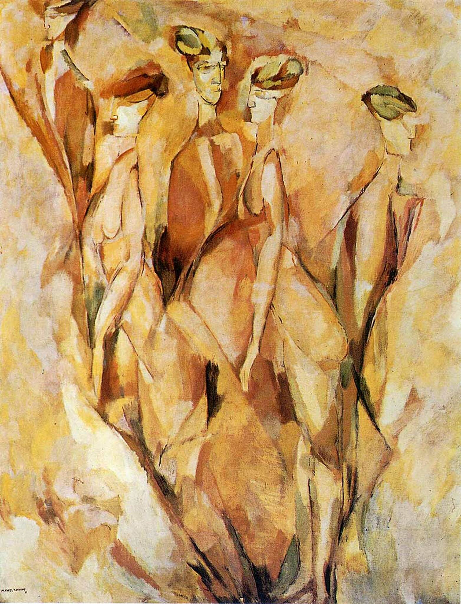

## 基本信息

- 作者：[[杜尚 Marcel Duchamp]]
- 创作年代：1911
- 材质：布面油画 (*not from wiki*)
- 尺寸：146 × 114 cm (*not from wiki*)
- 现存地：费城美术馆 (Philadelphia Museum of Art) (*not from wiki*)

## 画面与技法

画的是杜尚在巴黎时期的一个不知名女邻居——身材高挑、经常出来遛狗。他不知道她叫什么，故意拿堂吉诃德笔下高不可攀的情人 "Dulcinée"（杜尔西尼娅）戏谑命名，自嘲性幻想。

画面**把她的五个状态画在同一帧上：三个穿衣、两个裸体**。顾衡把这看作时间维度以 [[柏格森 Henri Bergson]] 主观时间——也就是 [[绵延 Durée]] ——的形式进入空间。

> 与 [[巴拉 Giacomo Balla]] 同样遛狗主题的《[[被拴住的狗的动态 Dynamism of a Dog on a Leash]]》(1912) 形成对照：巴拉的是 3D 空间中高速摄影叠合（运动感）；杜尚是想象的**高维空间里对时间的整合**——智力层级不在一个水平上，分析立体主义对未来主义因此鄙夷。

## 画面之外（创作理念）

顾衡把这幅画当作杜尚创作理念的"特别能表现"之作——"杜尚骨子里是个知识分子，**绘画一定要为理念服务**。我脑子里对杜尔西尼娅有各种各样的性幻想，那我就以这个性幻想为由头，把我对庞加莱四度空间、黎曼几何、爱因斯坦相对论和柏格森生命哲学这些学问，都抖落抖落。"

## 历史背景

(*not from wiki*) 1911 年作品，1912 年也送展独立沙龙——比《[[下楼梯的裸女 Nude Descending a Staircase No. 2]]》早一年，但当时未遭遇皮托集团的退稿尴尬。

## 图片清单

| 编号 | 出自 | 描述 |
|---|---|---|
| 01 | [[089｜杜尚2：什么是他人生的转折点？]] | 五个状态叠合整图 |

## 出现在

- [[089｜杜尚2：什么是他人生的转折点？]]
