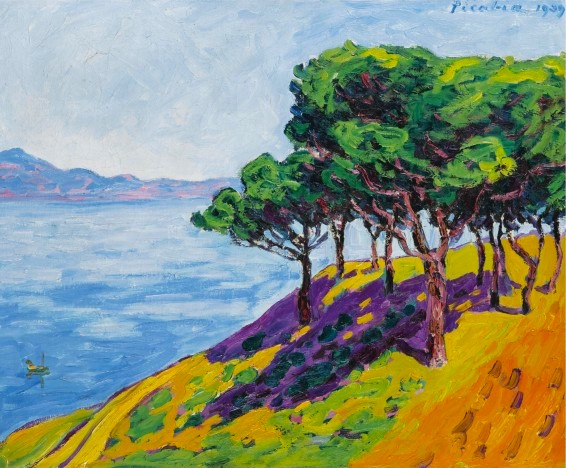

## 基本信息

- 作者：[[毕卡比亚 Francis Picabia]]
- 创作年代：1909
- 材质：布面油画 (*not from wiki*)
- 尺寸：年代不详 (*not from wiki*)
- 现存地：私人收藏 (*not from wiki*)

## 画面与技法

[[毕卡比亚 Francis Picabia]] **野兽派尝试期**作品——1909 年前后，他对印象派的轻易成功产生厌倦，转向 [[野兽派 Fauvism]]。"不过这些画并没有引起什么反响"——这是顾衡的判断。

## 历史背景

(*not from wiki*) 1909 年 [[马蒂斯 Henri Matisse]] 已开始离开纯野兽派路线；毕卡比亚反向"入场"略晚。

## 图片清单

| 编号 | 出自 | 描述 |
|---|---|---|
| 01 | [[091｜毕卡比亚：如何用绘画表现达达主义？]] | 整体图 — 野兽派笔触的松树 |

## 出现在

- [[091｜毕卡比亚：如何用绘画表现达达主义？]]
