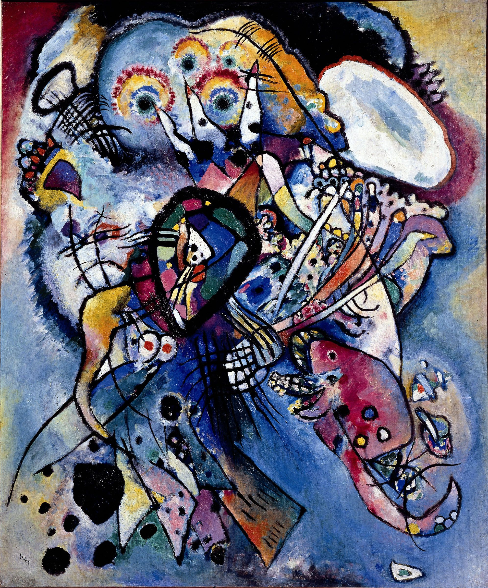

## 基本信息

- 作者：[[康定斯基 Wassily Kandinsky]]
- 创作年代：1919
- 材质：布面油画 (*not from wiki*)
- 尺寸：(*not from wiki*)
- 现存地：圣彼得堡俄罗斯博物馆 (State Russian Museum, St. Petersburg) (*not from wiki*)

## 画面与技法

顾衡 082 与《[[灰色 Im Grau]]》并列，作为康定斯基**1919 年一战后放弃"事后具象解释"**习惯、真正进入纯抽象阶段的样本。

## 图片清单

| 编号 | 出自 | 描述 |
|---|---|---|
| 01 | [[082｜康定斯基2：他为什么走向抽象？]] | 一战后真正进入纯抽象的代表 |

## 出现在

- [[082｜康定斯基2：他为什么走向抽象？]]
