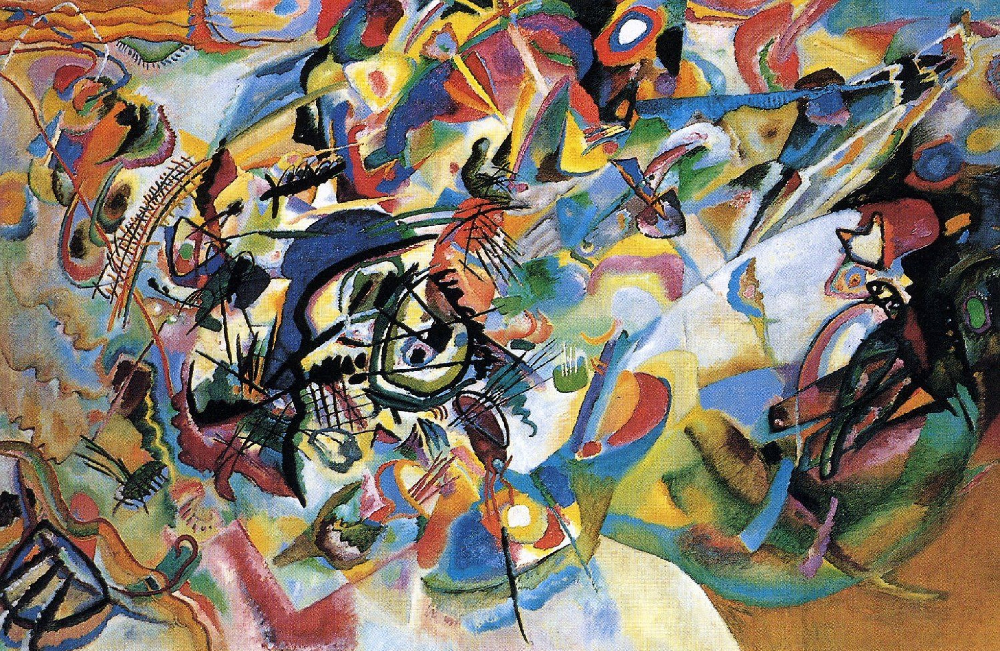

## 基本信息

- 作者：[[康定斯基 Wassily Kandinsky]]
- 创作年代：1913
- 材质：布面油画 (*not from wiki*)
- 尺寸：200 × 300 cm (*not from wiki*)
- 现存地：莫斯科特列季亚科夫画廊 (Tretyakov Gallery, Moscow) (*not from wiki*)

## 画面与技法

康定斯基**前抽象时期最庞大、最复杂的画作**之一。顾衡 082 引述康定斯基的自述——

> "绘画必须精确，所有色彩的形式必须被精晰地放置在画布上，就如同乐谱中的音符。"

顾衡反讽："**但是我们看他这个时期的作品，实在是难以把它们与'精确'这个词联系在一起。**"

本画即此论的代表：表面狂放无序，康定斯基却强调底层精密如乐谱——这正是他借鉴 [[瓦格纳 Richard Wagner]]"[[总体艺术 Gesamtkunstwerk]]"理念，把绘画当作交响乐"指挥"的核心实践。

## 图片清单

| 编号 | 出自 | 描述 |
|---|---|---|
| 01 | [[082｜康定斯基2：他为什么走向抽象？]] | 1913 年大尺幅"绘画 = 交响乐"实践 |

## 出现在

- [[082｜康定斯基2：他为什么走向抽象？]]
