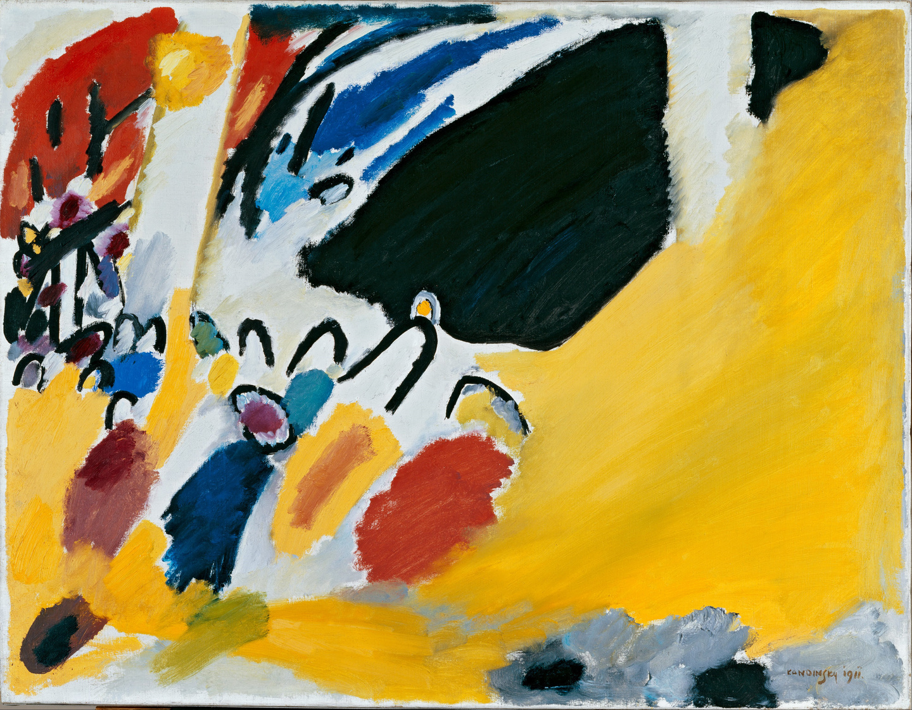

## 基本信息

- 作者：[[康定斯基 Wassily Kandinsky]]
- 创作年代：1911
- 材质：布面油画 (*not from wiki*)
- 尺寸：(*not from wiki*)
- 现存地：原作在二战中被毁；仅存照片 (*not from wiki*)

## 画面与技法

顾衡 082 与《[[即兴6 Improvisation 6 (African)]]》并列举证——名字虽抽象（《构图3》《即兴6》），但**画面仍指向具象事物**（"音乐会"），抽象的不彻底由此可见。

## 图片清单

| 编号 | 出自 | 描述 |
|---|---|---|
| 01 | [[082｜康定斯基2：他为什么走向抽象？]] | 名"构图"但仍指向"音乐会"具象 |

## 出现在

- [[082｜康定斯基2：他为什么走向抽象？]]
