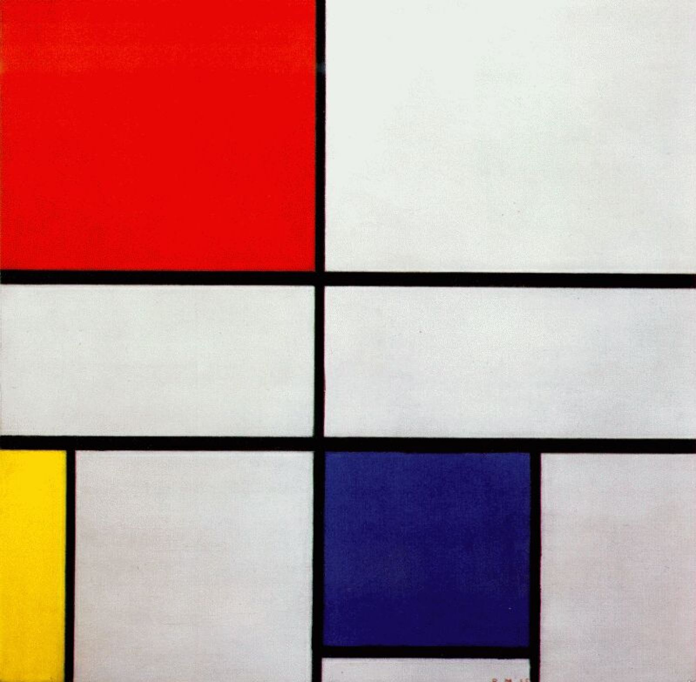

## 基本信息

- 作者：[[蒙德里安 Piet Mondrian]]
- 创作年代：1935
- 材质：(*not from wiki*：布面油画)
- 尺寸：(*not from wiki*：约 56 × 55 cm)
- 现存地：(*not from wiki*：私人收藏 / 流转中)

## 画面与技法

由几条黑色直线把白色画布分割成若干长方形格子，三个格子分别填入红、黄、蓝三原色色块——这是蒙德里安 [[新造型主义 Neo-Plasticism]] 的标准图式。黑线只走横向和竖向，斜线被完全排除。

## 历史背景 (*not from wiki*)

属于蒙德里安 1920 年代起持续生产的"红黄蓝构图"系列。这些作品看似可以快速复制，实则需要画家手工反复调整黑线粗细位置与色块大小比例，直到画家感到"通灵"的那一刹那。

## 图片清单

| 编号 | 出自 | 描述 |
|---|---|---|
| 01 | [[084｜蒙德里安：他为什么要画那么多格子？]] | 构图三 红黄蓝（1935） |

## 出现在

- [[084｜蒙德里安：他为什么要画那么多格子？]]
