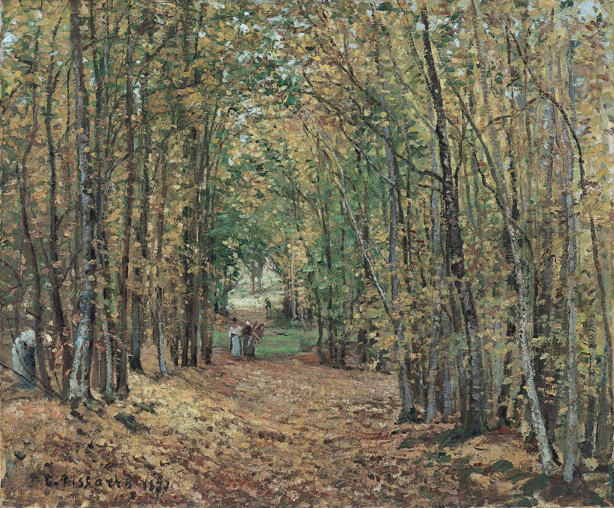

## 基本信息

- 作者：[[毕沙罗 Camille Pissarro]]
- 创作年代：1871
- 材质：布面油画 (*not from wiki*)
- 尺寸：(*not from wiki*) 约 45 × 55 cm
- 现存地：(*not from wiki*) 私人收藏 / 流转中

## 画面与技法

[[毕沙罗 Camille Pissarro]] **1890 前乡居时期**的代表作——蓬图瓦兹近郊（或马尔利附近）森林中一条**没有名字的小路**。无人物、无情节——画面的全部内容就是树木、阴影、泥土与远处的光斑。

## 在课程中的角色

顾衡 044 用本作作为毕沙罗"**恬淡内敛**"性格的视觉隐喻——课程明文："**但总的说来，毕沙罗是恬淡的、内敛的，就像他隐居的蓬图瓦兹树林中这条没有名字的小路。**" 这是 044 中**最具诗意的画家肖像式画作描述**之一。

## 图片清单

| 编号 | 出自 | 描述 |
|---|---|---|
| 01 | [[044｜莫利索和毕沙罗：最纯正的印象派什么样？]] | 全画，无人物的林中小路 |

## 出现在

- [[044｜莫利索和毕沙罗：最纯正的印象派什么样？]] —— 毕沙罗内敛性格的视觉隐喻
- [[毕沙罗 Camille Pissarro]] —— 代表作之一
