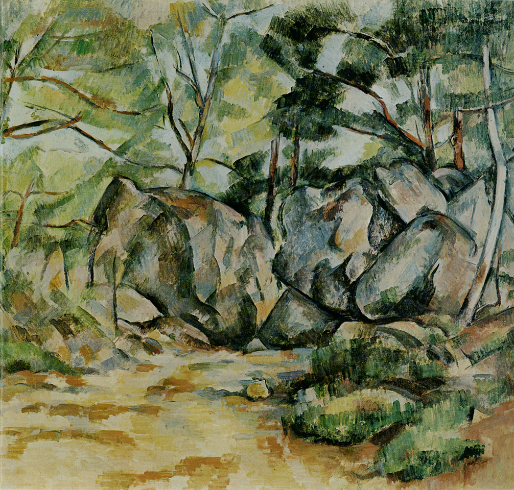

## 基本信息

- 作者：[[塞尚 Paul Cézanne]]
- 创作年代：1894–1898
- 材质：油彩，画布 (*not from wiki*)
- 尺寸：(*not from wiki*) 约 73 × 92 cm
- 现存地：(*not from wiki*) 美国纽约大都会艺术博物馆 (Metropolitan Museum of Art)

## 画面与技法

[[塞尚 Paul Cézanne]] 第三阶段（成熟期）的森林风景之一。顾衡 054 把它和 [[河岸 Riverbanks (Cézanne)]] 并列引证：在塞尚晚期"探究形状内在机制"的实验中，**自然界的连续景物被简化为相互应和的色块单元**——树干、岩石、林荫，都呈现出向规则几何体（球体、圆柱体、圆锥体）靠近的内在骨骼。

## 历史背景 (*not from wiki*)

1890s 后期塞尚长居家乡普罗旺斯艾克斯（Aix-en-Provence），在维多利亚山附近的森林、采石场（Bibémus、Château Noir 周边）反复写生。森林岩石主题与 [[圣维多利亚山 Mont Sainte-Victoire]] 系列、晚期 [[浴女们 The Large Bathers|浴女]] 系列同属其成熟期"几何骨骼 + 主观色彩"实验的核心场。

## 图片清单

| 编号 | 出自 | 描述 |
|---|---|---|
| 01 | [[054｜塞尚3：为什么理解塞尚那么困难？]] | 全图——成熟期森林风景示范 |

## 出现在

- [[054｜塞尚3：为什么理解塞尚那么困难？]] —— 第三阶段森林主题
