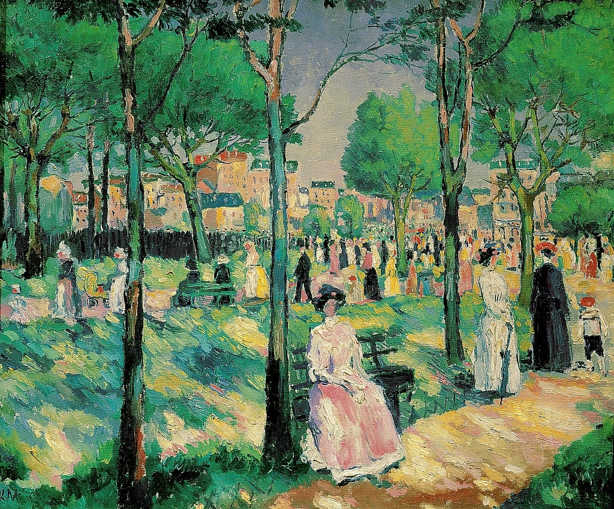

## 基本信息

- 作者：[[马列维奇 Kazimir Malevich]]
- 创作年代：1903
- 材质：布面油画 (*not from wiki*)
- 尺寸：年代不详 (*not from wiki*)
- 现存地：俄罗斯圣彼得堡国立俄罗斯博物馆 (*not from wiki*)

## 画面与技法

[[马列维奇 Kazimir Malevich]] 早期作品。明显摆脱 [[施希金 Ivan Shishkin]] 的写实风格，已经吸收了 [[印象派 Impressionism]] 元素——光斑笔触、随意的人物姿态、强调瞬间感。

## 历史背景

顾衡 083 指出：马列维奇毕业后通过 [[史楚金 Sergei Shchukin]]、[[莫洛索夫 Ivan Morozov]] 等俄国藏家的渠道，第一时间了解到巴黎现代绘画的最新进展。1903 年的《林荫大道》和《卖花女》已经"摆脱了施希金，而有了印象派元素"。

## 图片清单

| 编号 | 出自 | 描述 |
|---|---|---|
| 01 | [[083｜马列维奇：什么是至上主义？]] | 全画 |

## 出现在

- [[083｜马列维奇：什么是至上主义？]]
