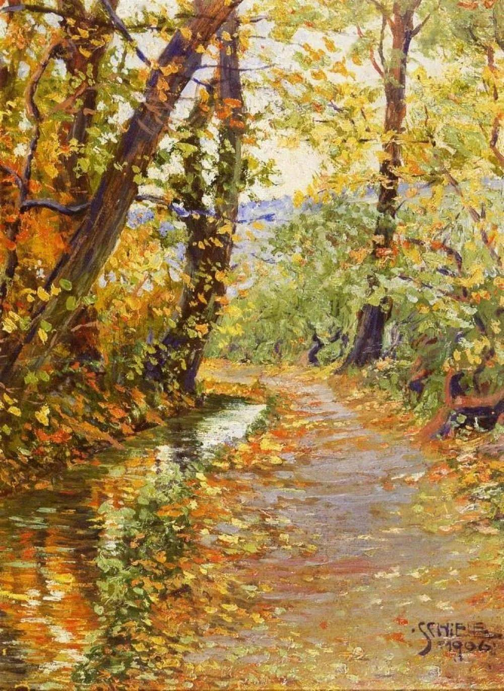

## 基本信息

- 作者：[[席勒 Egon Schiele]]
- 创作年代：1906
- 材质：（*not from wiki*）板上油画
- 尺寸：（*not from wiki*）暂缺
- 现存地：（*not from wiki*）暂缺

## 画面与技法

顾衡 074：席勒入维也纳艺术学院头一年的练手作之一——"明显看出他在努力学习来自法国的新潮流"。本作是**[[印象派 Impressionism]] 风格**的练习：林间小溪 / 短笔触 / 室外光感。

## 历史背景 (*not from wiki*)

- 1906 = 席勒以优异成绩考入维也纳艺术学院的同一年；他与导师 [[格吕彭克尔 Christian Griepenkerl]] 不和，主要靠**个人摸索**追法国新潮流——这批 1906–1907 的风景画反映了他对印象派、新印象派、塞尚的吸收

## 图片清单

| 编号 | 出自 | 描述 |
|---|---|---|
| 01 | [[074｜席勒1：他为什么走向表现主义？]] | 全图 |

## 出现在

- [[074｜席勒1：他为什么走向表现主义？]]
