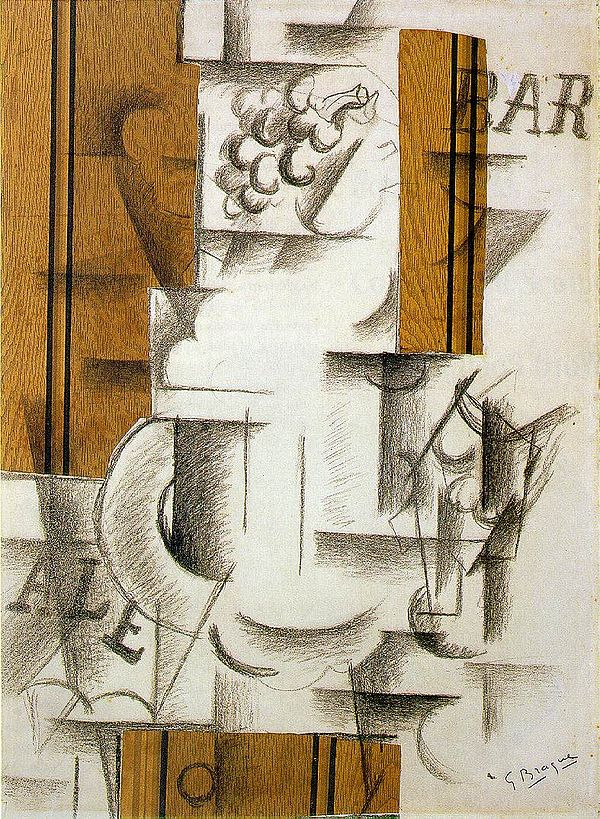

## 基本信息

- 作者：[[勃拉克 Georges Braque]]
- 创作年代：1912
- 材质：纸贴 + 炭笔 (papier collé)；纸面 (*not from wiki*)
- 尺寸：62 × 44.5 cm (*not from wiki*)
- 现存地：私人收藏 (*not from wiki*)

## 画面与技法

被广泛视为**综合立体主义 (Synthetic Cubism)** 的开山之作——**勃拉克率先把一张木纹仿真纸 (faux-bois wallpaper) 粘到画布上**，再以炭笔在拼贴的纸上勾勒果盘与杯子的轮廓。

这是**papier collé（纸贴）技法的诞生**：从"分析"几何切面拆解物体，转向**直接把现成材料嵌入画面**，去构成 ("综合") 整体——分析立体主义到综合立体主义的转折点。

顾衡明示："**到了综合立体主义时期，也是勃拉克率先想到的在画布上贴一张旧报纸。**"

## 历史背景 (*not from wiki*)

1912 年勃拉克在阿维尼翁附近 Sorgues 一间画材店看到木纹仿真壁纸，立刻买回工作室开始拼贴实验。这件作品成为综合立体主义、collage、乃至 20 世纪混合材料艺术的源头之一。

## 图片清单

| 编号 | 出自 | 描述 |
|---|---|---|
| 01 | [[068｜立体主义，除了毕加索还值得了解什么？]] | 综合立体主义开山之作 / papier collé 首创 |

## 出现在

- [[068｜立体主义，除了毕加索还值得了解什么？]] —— 综合立体主义"在画布上贴纸"的首创
