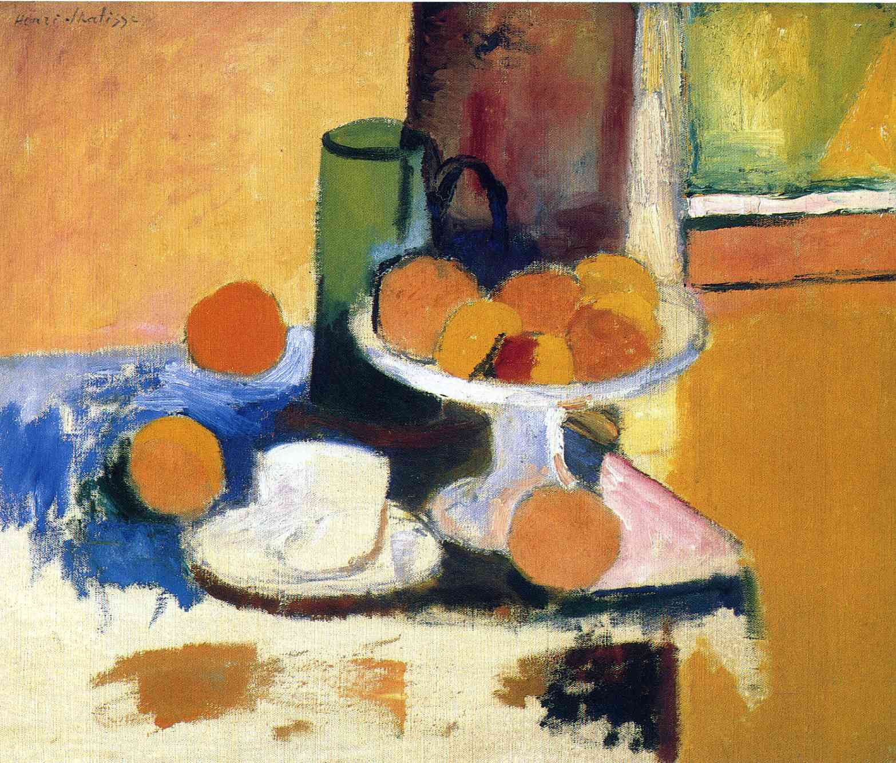

## 基本信息

- 作者：[[马蒂斯 Henri Matisse]]
- 创作年代：1899
- 材质：油彩，画布 (*not from wiki*)
- 现存地：(*not from wiki*)

## 画面与技法

[[马蒂斯 Henri Matisse]] **塞尚影响期代表作之一**（060 明示）—— "马蒂斯那个时期的作品，比如这幅《柳橙与静物》，就体现出塞尚强烈的影响"。

体现 [[塞尚 Paul Cézanne]] 教给马蒂斯的三大技法：
1. **分节** 的概念
2. **用颜色来直接塑造形体**
3. **抛弃明暗、直接用主观的颜色序列来暗示纵深**（[[主观色彩序列 Subjective Colour Sequence]]）

## 图片清单

| 编号 | 出自 | 描述 |
|---|---|---|
| 01 | [[060｜马蒂斯1：野兽派从何而来？]] | 全图——塞尚风格静物 |

## 出现在

- [[060｜马蒂斯1：野兽派从何而来？]]
