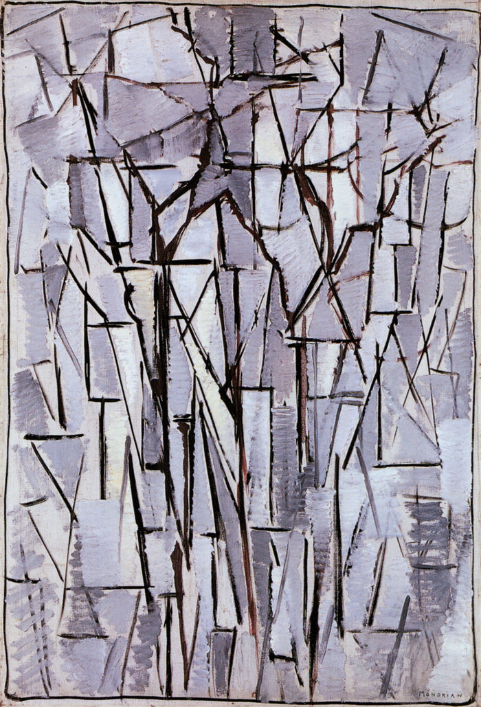

## 基本信息

- 作者：[[蒙德里安 Piet Mondrian]]
- 创作年代：1912
- 材质：(*not from wiki*：布面油画)
- 尺寸：(*not from wiki*：约 98 × 65 cm)
- 现存地：(*not from wiki*：海牙市立博物馆)

## 画面与技法

承接 [[灰树 (蒙德里安) Gray Tree]]（1911）的立体主义解构方向，进一步把枝干打散成横竖短线的网格——具象的"树"几乎已经不可辨识，但还没有彻底脱离物象。色彩进一步降至灰褐与赭石的低饱和度区间。

## 历史背景 (*not from wiki*)

属于蒙德里安"树"系列的最末端，其后他就不再借具象物作为载体，转向把所有形象简化为短横线与短竖线（[[海堤与海 构成十号 (蒙德里安) Composition No. 10 Pier and Ocean]]）。

## 图片清单

| 编号 | 出自 | 描述 |
|---|---|---|
| 01 | [[084｜蒙德里安：他为什么要画那么多格子？]] | 树 构图二号（1912） |

## 出现在

- [[084｜蒙德里安：他为什么要画那么多格子？]]
