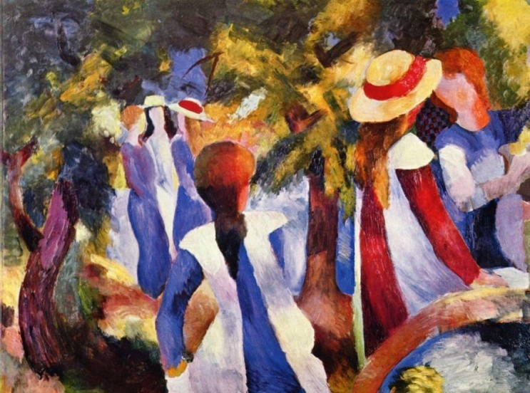

## 基本信息

- 作者：[[马克 August Macke]]
- 创作年代：1914
- 材质：油画 (*not from wiki*)
- 现存地：慕尼黑·州立现代艺术馆 (*not from wiki*)

## 画面与技法

本讲举例：[[马克 August Macke]] 在 [[青骑士 Der Blaue Reiter]] 内部走的是"比较中规中矩"路线——不像 [[马尔克 Franz Marc]] 那样追随 [[康定斯基 Wassily Kandinsky]] 直奔抽象。本画是**典型的 [[野兽派 Fauvism]] 风格**：装饰性平面色块、绿叶 + 人物简化为几何贴片。

## 历史背景

(*not from wiki*) 1914 年是马克最具创造力的年份；同年他与朋友 [[克利 Paul Klee]]、Louis Moilliet 一起完成著名的突尼斯之旅。几个月后随即参军，年内即阵亡于香槟战场。

## 图片清单

| 编号 | 出自 | 描述 |
|---|---|---|
| 01 | [[085｜克利：他为什么模仿小孩子画画？]] | 树下人物，野兽派装饰风 |

## 出现在

- [[085｜克利：他为什么模仿小孩子画画？]]
