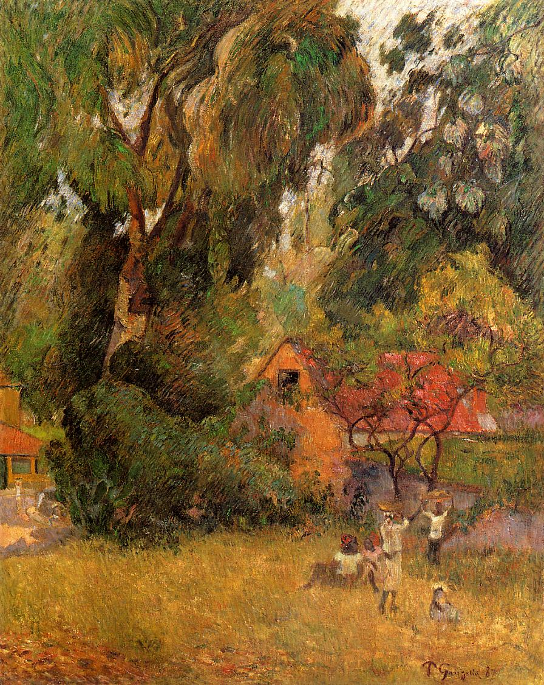

## 基本信息

- 作者: [[高更 Paul Gauguin]]
- 创作年代: 1887
- 材质: 布面油画 (*not from wiki*)
- 尺寸: 年代不详
- 现存地: (*not from wiki*)

## 画面与技法

高更印象派末期、马提尼克之行前后的过渡作品——顾衡 055 描述："在以前风格基础上加一点日本浮世绘、加一点[[塞尚 Paul Cézanne]]，但步子迈得并不大，总体上仍然是毕沙罗印记很重的印象派风格。"

## 历史背景 (*not from wiki*)

1886 第八届印象派画展后印象派团体解散；高更四处摸索新方向。1887 与友人赴马提尼克岛——回法后画风大变（参见 055 后段所列《有三条小狗的静物》《打干草》《三个跳舞的布列塔尼女孩儿》）。

## 图片清单

| 编号 | 出自 lecture | 描述 |
|---|---|---|
| 01 | [[055｜高更1：为什么从印象派走向象征主义？]] | 全图 |

## 出现在

- [[055｜高更1：为什么从印象派走向象征主义？]]
