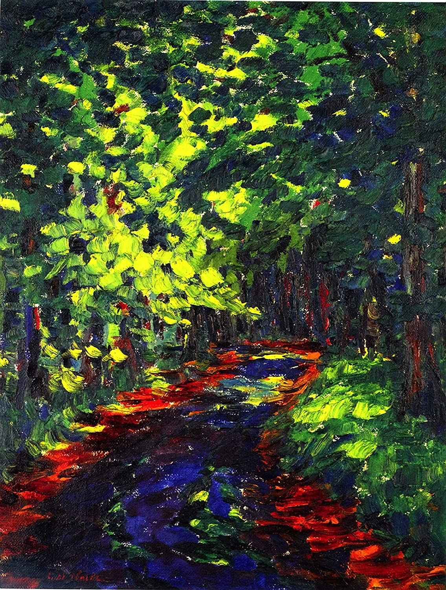

## 基本信息

- **作者**：[[诺尔德 Emil Nolde]]
- **创作年代**：1909
- **材质**：布面油画 (*not from wiki*)
- **尺寸**：暂不详 (*not from wiki*)
- **现存地**：暂不详 (*not from wiki*)

## 画面与技法

- 072 中举为诺尔德**早期作品**的代表——"[[印象派 Impressionism]] 和 [[新印象主义 Neo-Impressionism]] 的痕迹还是很明显的"——即诺尔德 1899 巴黎朱利安美术学院之后的余响。
- 与 [[阅读 (诺尔德) Spring in the Room]] 并置，作为诺尔德"印象派学徒期"双图例。

## 历史背景 (*not from wiki*)

1909 年诺尔德正处于"艺界浪人"末期、向**表现主义专属语言**过渡的临界点。

## 图片清单

| 编号 | 出自 | 描述 |
|---|---|---|
| 01 | [[072｜桥社：什么是表现主义绘画的使命？]] | Forest Path 1909 — 早期印象派痕迹 |

## 出现在

- [[072｜桥社：什么是表现主义绘画的使命？]]
