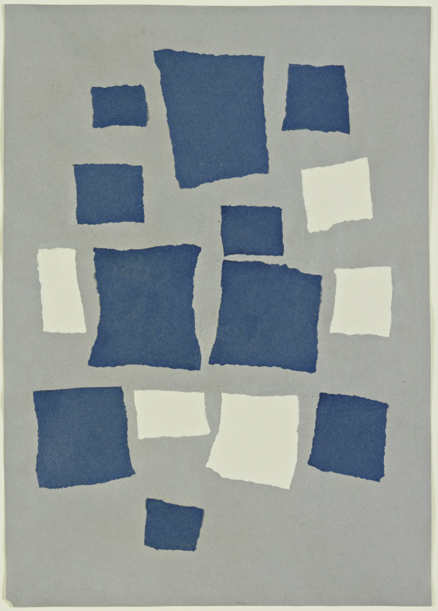

## 基本信息

- **作者**：[[让·阿尔普 Jean Arp]]
- **创作年代**：1916—1917
- **材质**：纸上撕纸拼贴 (torn-and-pasted paper on paper) (*not from wiki*)
- **尺寸**：48.5 × 34.6 cm (*not from wiki*)
- **现存地**：纽约现代艺术博物馆 MoMA (*not from wiki*)

## 画面与技法

阿尔普先把**一张蓝色的纸撕成若干个正方形**，再把**一张奶油色的纸撕成若干个正方形**——然后把这些碎片**从一米高处自由洒落到一张大卡纸上**，落点决定最终构图——理论上这是"**随机法则 (the law of chance)**"——一种把"语言-意识-意志"全部排除在外的非具象生成程序。

顾衡的现场审看判断：**"很难相信这个效果是完全随机造成的。阿尔普显然是动了手脚的。"**

理由（隐含）：
- 正方形之间间距均匀
- 蓝/奶油两色的分布平衡
- 大致沿一条隐性网格排列
- 与同代偶然实验（如把素描撕碎天女散花）形成的"真随机"对比，本作排布过于讲究

## 概念脉络

- **求助于偶然性 (Chance)** —— [[达达主义 Dadaism]] 反语言纲领的兑现路径——既然语言被嵌入了道德、宗教、社会权威，那就用随机绕过它
- 与同年代 [[雨果·鲍尔 Hugo Ball]] 的"袋装词碎片诗"是**同一程序**的诗 / 画两面
- 下游影响：超现实主义自动主义、20 世纪后期过程艺术 / 偶然性音乐（约翰·凯奇）(*not from wiki*)

## 图片清单

| 编号 | 出自 | 描述 |
|---|---|---|
| 01 | [[087｜什么是达达主义？]] | 完整作品（蓝/奶油正方形撕纸拼贴于卡纸） |

## 出现在

- [[087｜什么是达达主义？]]
