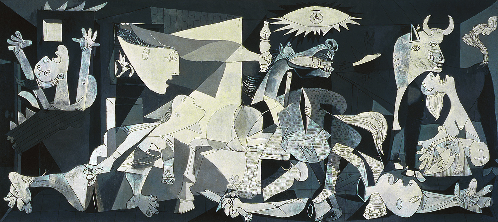

## 基本信息

- 作者：[[毕加索 Pablo Picasso]]
- 创作年代：1937
- 材质：(*not from wiki*) 布面油画
- 尺寸：(*not from wiki*) 349 × 776 cm（**巨幅墙画规模**）
- 现存地：(*not from wiki*) Museo Reina Sofía, Madrid

## 画面与技法

毕加索一生**最具公共影响力的作品**，使他真正"暴得大名"。画面以**黑白灰单色调**呈现一片混乱——嘶吼的马、倒地的士兵、举手呼号的女人、抱着死去婴儿的母亲、点亮电灯的鸟瞰之眼、燃烧的房屋——以**象征主义手法**控诉佛朗哥对平民的暴行。

技法上是 [[综合立体主义 Synthetic Cubism]] 的几何变形 + [[超现实主义 Surrealism]] 的梦境式拼贴 + 古典壁画式构图，是毕加索一生立体主义元素与艺术语言的集大成。

## 历史背景

顾衡 067："格尔尼卡是西班牙北部的一个小镇。1937 年的西班牙，共和政府跟 [[佛朗哥 Francisco Franco]] 内战正酣，佛朗哥杀红了眼，租了 43 架德国轰炸机对小城格尔尼卡进行了轰炸，1654 人当场炸死，另有近千人受伤。欧洲一片哗然。这一年，正赶上巴黎举办世博会。西班牙共和政府就委托毕加索为世博会西班牙馆画一幅大画，谴责佛朗哥针对平民的暴行，毕加索就以象征主义的手法画了这幅《格尔尼卡》。西班牙共和政府迅速组织了这幅画的全欧洲巡展，以争取支持。这下子，全欧洲都知道了毕加索的名字。"

(*not from wiki*) 实际轰炸日期为 1937 年 4 月 26 日，由纳粹德国"秃鹰军团"与意大利空军执行；伤亡数字历史学界至今有争议，约 200-1600 人。1937 巴黎世博会西班牙馆委托后，毕加索仅用 35 天完成。

## 图片清单

| 编号 | 出自 | 描述 |
|---|---|---|
| 01 | [[067｜毕加索4：什么是综合立体主义？]] | 整体图 |

## 出现在

- [[067｜毕加索4：什么是综合立体主义？]]
