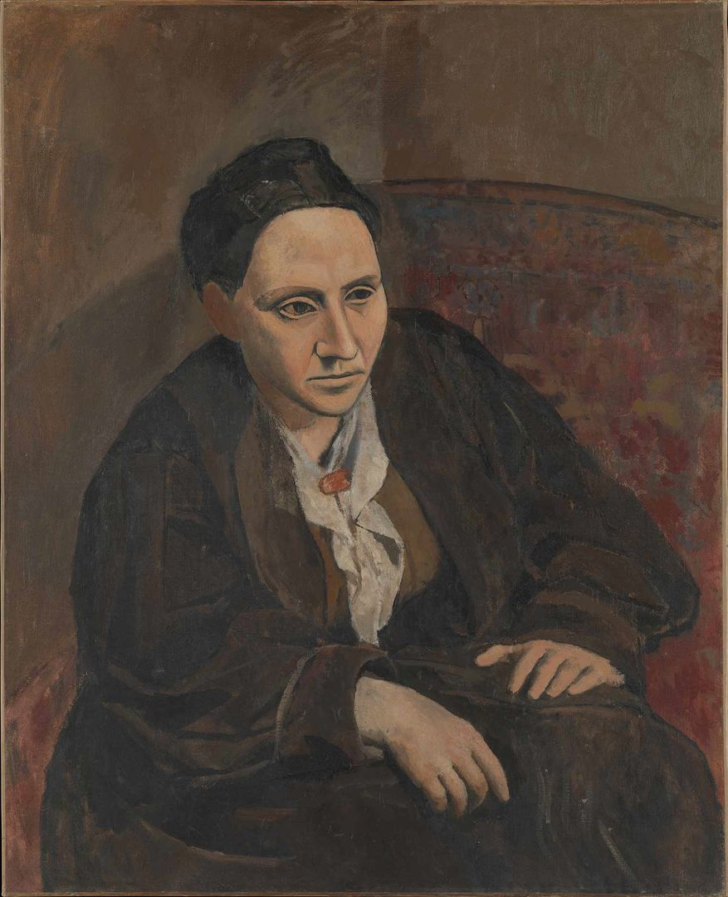
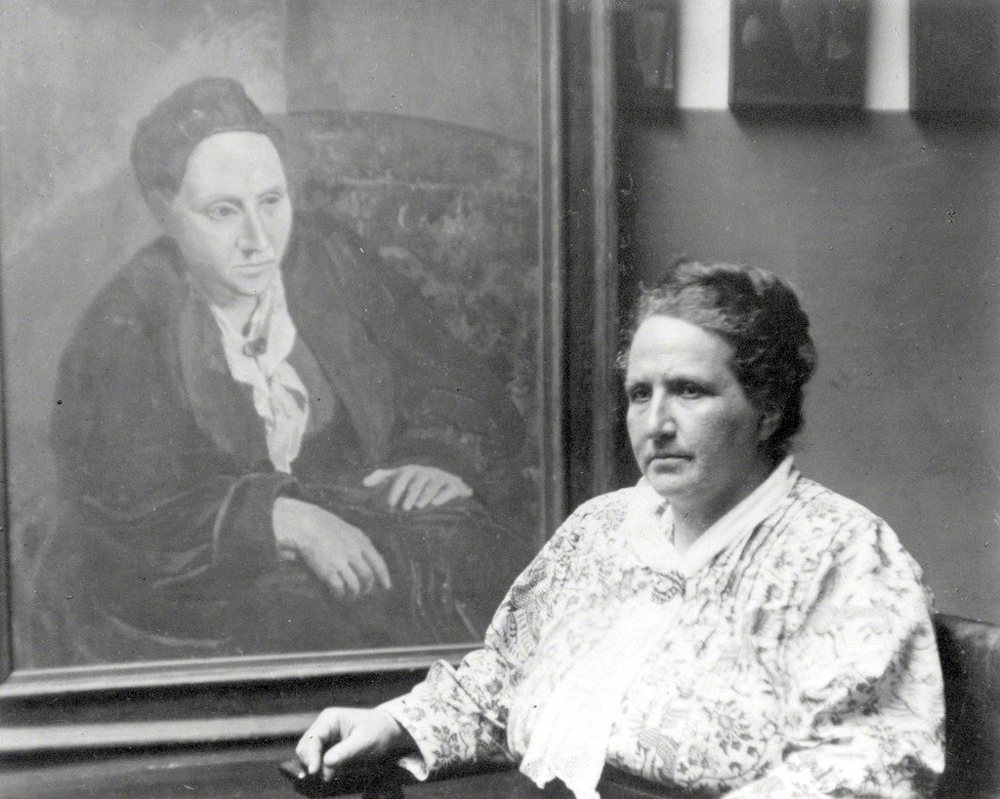

## 基本信息

- 作者：[[毕加索 Pablo Picasso]]
- 创作年代：1905—1906
- 材质：油彩，画布 (*not from wiki*)
- 尺寸：(*not from wiki*) 约 100 × 81.3 cm
- 现存地：(*not from wiki*) 纽约大都会艺术博物馆 (The Met)——斯坦因 1946 年遗赠

## 画面与技法

[[黑人时期 African Period (Picasso)|黑人时期]] **几何化倾向阶段**最著名的肖像。

**创作过程**：[[毕加索 Pablo Picasso]] 让 [[格特鲁德·斯坦因 Gertrude Stein]] 当模特竟达 **80 次**——女朋友费尔南德在旁朗读小说为模特解闷。但**最后一次毕加索仍把脸涂掉**——他卡在了一个核心问题上："用程式化的、规则几何图形来表现客观世界中的物体，到底应该走到什么程度、应该在哪里停下来？"

**没有模特的最终完成**：几个月后，在没有模特的情况下毕加索补完此画。

**"她会越长越像这幅画的"**：大家看完都说不像，毕加索答："**没关系，她会越长越像这幅画的**"——这句话的内涵是他追求的不是形似、不是神似，而是**骨似**（内在结构性相似）。

**脸的造型**：明显的[[古埃及艺术 Ancient Egyptian Art|古埃及面具风]]——脸型、鼻子、眼睛的形状程式化、对称化、面具化。

**对后续作品的延续**：[[毕加索 Pablo Picasso]] 同期画的 [[持调色板的自画像 Self-Portrait with Palette (Picasso)|《持调色板的自画像》]] 用同一程式；中间两位[[亚威农少女 Les Demoiselles d'Avignon|《亚威农少女》]]中的脸庞和眼睛也直接复用此程式。

## 历史背景 (*not from wiki*)

- [[格特鲁德·斯坦因 Gertrude Stein]] 是 20 世纪初**巴黎最重要的现代艺术沙龙女主人**之一——与哥哥利奥·斯坦因每周四接待 [[马蒂斯 Henri Matisse]]、[[毕加索 Pablo Picasso]]、[[阿波利奈尔 Guillaume Apollinaire]]、[[海明威 Ernest Hemingway]] 等。
- **斯坦因终生带着这幅画**，晚年还和它合影，自言"确实越来越像"——1946 年她去世后遗赠纽约大都会。
- 当时此画也被认为不像，但**今天已成为斯坦因的"定档脸"**——证明毕加索"骨似"预言成立。

## 图片清单

| 编号 | 出自 | 描述 |
|---|---|---|
| 01 | [[065｜毕加索2：如何理解"黑人时期"？]] | 全图——古埃及面具风的程式化肖像 |
| 02 | [[065｜毕加索2：如何理解"黑人时期"？]] | 斯坦因晚年与肖像合影——"确实越来越像" |

## 出现在

- [[065｜毕加索2：如何理解"黑人时期"？]] —— [[黑人时期 African Period (Picasso)|黑人时期]] 几何化倾向的代表作 + "骨似"宣言的载体
