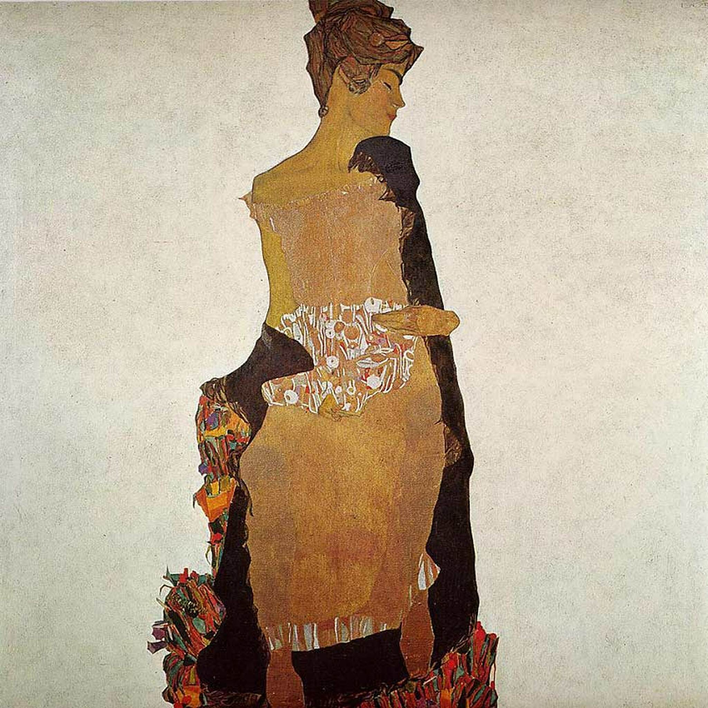

## 基本信息

- **作者**：[[席勒 Egon Schiele]]
- **创作年代**：1909
- **材质**：油彩、银粉、金粉、铜粉、铅笔，画布 (*not from wiki*)
- **尺寸**：约 139.5 × 140.5 cm (*not from wiki*)
- **现存地**：纽约现代艺术博物馆 MoMA (*not from wiki*)

## 画面与技法

席勒妹妹格蒂（Gerti Schiele）的肖像。此时席勒仍处于受 [[克里姆特 Gustav Klimt]] 装饰风格强烈影响的阶段——**几何形状的色块**形成**纯粹的装饰效果**（顾衡 075）。是典型的"克里姆特式过渡期"作品。

## 历史背景 (*not from wiki*)

格蒂是席勒最亲密的妹妹之一，从童年起便长期为兄长做模特。

## 图片清单

| 编号 | 出自 | 描述 |
|---|---|---|
| 01 | [[075｜席勒2：为什么他是"最表现主义"的画家？]] | 肖像正面 |

## 出现在

- [[075｜席勒2：为什么他是"最表现主义"的画家？]]
